# Handoff: Glorbo · TUI Redesign (V1)

**Target repo:** `foobarto/glorbo` (Elixir 1.18.4 / OTP 28 / Phoenix LiveView, `main` branch, v0.0.4)

## Overview

Glorbo is a director-facing dashboard over `~/.glorbo/` — a directory tree
where each company is a folder, each agent an `agent.md` with a running
process, and all state (chat, audit, memory, approvals) is plain files a
human can `grep`.

This handoff is a **redesign** of every Director-facing view in the
Phoenix LiveView dashboard. It commits to one direction — **TUI-tight**:
monospace, green-on-black, keyboard-first, terminal-authentic. Every UI
element maps to something a shell user would recognize: prompts, file
paths, pipes, status bars.

This package is the output of a design exploration; your job is to
**re-implement each LiveView and component under `lib/glorbo_web/` to
match these designs**, using the project's existing stack (Phoenix
LiveView + inotify + app.css + the small JS-hooks bundle). Do **not**
import the HTML prototype files directly — they're pixel references.

## About the design files

Everything in `source/` is a **design reference** — React-via-Babel HTML
prototypes showing intended look and behavior. The prototypes share a
single CSS file (`source/styles.css`) and a single Babel transpile step.
Treat them as Figma-in-HTML:

- **Do** copy exact hex values, spacing, typography, content, and
  interaction contracts.
- **Don't** ship the JSX files as-is — re-implement components in the
  Glorbo codebase's idiom (LiveView / Phoenix / React / whatever is
  already there).
- **Don't** copy Babel-standalone, unpkg React imports, or the
  `.design-canvas.jsx` harness — those are prototype plumbing.

If the Glorbo codebase already has reusable chrome (top bar, sidebar,
status bar), adapt this design **into** those components rather than
forking new ones.

## Fidelity

**High-fidelity.** All colors, typography, spacing, content, and
interaction semantics are final. Implement them exactly as shown —
deviation from the terminal aesthetic (adding shadows, rounded corners,
gradients, sans-serif chrome) will break the identity.

Two deliberately low-fi areas:
- The **narrow-window / 640px** layout is a sketch; the core decision
  (collapse sidebar → top tab strip) is final, but spacing may need a
  pass on real device sizes.
- **Copy on edge states** (empty/error messages) is the intent; treat as
  editable if your team has a style guide for microcopy.

## Target environment

The existing Glorbo codebase, specifically:

- **Router:** `lib/glorbo_web/router.ex` — all live routes already exist
  under `/companies/:company/...`. Don't add new routes; update the
  LiveViews that mount at the existing ones.
- **LiveViews:** `lib/glorbo_web/live/*.ex` — one file per screen.
  Each LiveView's `render/1` is where the redesign lands.
- **Components:** `lib/glorbo_web/components/*.ex` — shared chrome
  (TopBar, Sidebar, StatusBar, ChatDrawer) and atoms (StatusPill,
  StatCard, TaskCard, Spark, Icon, BudgetRing). **Update these in
  place** — don't fork.
- **Stylesheet:** `assets/css/app.css` — single file, no build step.
  Merge `design-tokens.css` into it (under a `/* TUI tokens */`
  heading) and update existing rules to reference the new vars.
- **JS hooks:** `assets/js/` — keyboard shortcuts + any inotify hooks.
  No framework. Add new hooks here if a shortcut isn't already wired.

The project already ships a "terminal phosphor aesthetic with monospace,
OKLCH tokens, lowercase-slash panel headers" (per README) — this redesign
**sharpens and consolidates** that direction; it doesn't replace it with
something foreign.

## Route → LiveView → prototype map

The most useful section in this document. Drop this into Claude Code first;
it answers "which file do I edit for which design?".

| Route                                            | LiveView file                               | Prototype screen                  | Screenshot |
|--------------------------------------------------|---------------------------------------------|-----------------------------------|------------|
| `/companies`                                     | `lib/glorbo_web/live/overview_live.ex`      | *(deep-view; not shown separately — uses the same chrome as CompanyLive)* | — |
| `/companies/:company`                            | `lib/glorbo_web/live/company_live.ex`       | § 1 Company dashboard             | `01-company-dashboard.png` |
| `/companies/:company/kanban`                     | `lib/glorbo_web/live/kanban_live.ex`        | § 2 Kanban                        | `02-kanban.png` |
| `/companies/:company/agents/:agent`              | `lib/glorbo_web/live/agent_live.ex`         | § 3 Agent detail                  | `03-agent-detail.png` |
| `/companies/:company/inbox`                      | `lib/glorbo_web/live/inbox_live.ex`         | § 4 Inbox                         | `04-inbox.png` |
| `/companies/:company/audit`                      | `lib/glorbo_web/live/audit_live.ex`         | § 5 Audit log                     | `05-audit-log.png` |
| `/companies/:company/goals`                      | `lib/glorbo_web/live/goals_live.ex`         | § 6 Goals                         | `06-goals.png` |
| `/companies/:company/skills`                     | `lib/glorbo_web/live/skills_live.ex`        | § 7 Skills                        | `07-skills.png` |
| `/providers`                                     | `lib/glorbo_web/live/providers_live.ex`     | § 8 Providers                     | `08-providers.png` |
| `/companies/:company/channels/:channel`          | `lib/glorbo_web/live/channel_live.ex`       | § 9 Chat · full page              | `09-chat-full.png` |
| *(drawer expanded on CompanyLive)*               | `lib/glorbo_web/components/chat_drawer.ex`  | § 10 Company details *(the "drawer expanded" reference for the chat drawer's full form)* | `10-company-details.png` |
| *(any route, no data)*                           | per-LiveView empty clause                   | § 11 Empty state                  | `11-empty.png` |
| *(any route, during mount)*                      | per-LiveView loading clause                 | § 12 Loading skeleton             | `12-loading.png` |
| *(any route, error stack)*                       | — (toast + banner components)               | § 13 Errors                       | `13-errors.png` |
| global `⌘K`                                      | new `lib/glorbo_web/components/command_palette.ex` (backed by `/api/search`) | § 14 Command palette | `14-palette.png` |
| global `?`                                       | new `lib/glorbo_web/components/keys_overlay.ex` | § 15 Keyboard overlay          | `15-keys.png` |
| destructive actions                              | shared confirm modal in `core_components.ex` | § 16 Confirm · destructive        | `16-confirm.png` |
| narrow viewport (<960px)                         | CSS media queries in `app.css`              | § 17 Narrow window 640px          | `17-narrow-640.png` |
| `/` when daemon is down                          | error layout                                | § 18 500 · glorbo has fainted     | `18-err500.png` |
| any unknown path                                 | `PageController` + `not_found.html`         | § 19 404 · path not found         | `19-err404.png` |

Routes already present but **not covered by a redesign in this bundle**
(leave alone or apply the chrome-only changes from § Chrome):
`/health`, `/costs`, `/companies/:co/braindump`,
`/companies/:co/projects/:project`, `/companies/:co/tasks/:task_id`,
`/companies/:co/audit.csv`, `/api/search`, `/mcp`.

## Component map

Target components already exist in `lib/glorbo_web/components/`. **Update
in place**; do not fork. Prototype → Phoenix component mapping:

| Prototype (`source/v1.jsx`) | Existing component                       | Notes |
|-----------------------------|------------------------------------------|-------|
| `TopBar`                    | `topbar.ex`                              | Rewrite `render/1` to match prototype. Keep existing assigns. |
| `Sidebar`                   | `sidebar.ex`                             | Big file — preserve existing slot/rail logic, only update markup + classes. |
| `StatusBar`                 | `statusbar.ex`                           | Pipe-separated segments; assigns already carry daemon state. |
| `ChatDrawer` (minimized)    | `chat_drawer.ex` + `chat_drawer/`        | Folder already split; keep the boundary, restyle. |
| `Pill`, `StatusPill`        | `status_pill.ex`                         | Ensure variants cover `green/amber/red/mag/active`. |
| `StatCard` (KPI cards)      | `stat_card.ex` + `stat_breakdown.ex`     | Add the per-role helpers used in `01-company-dashboard.png`. |
| `TaskCard`                  | `task_card.ex`                           | Used by Kanban; already matches the data shape. |
| `Spark` (sparklines)        | `spark.ex`                               | Keep API; restyle to solid green-dim fill, no gradient. |
| `BudgetRing`                | `budget_ring.ex`                         | Prototypes use a horizontal bar instead — either is acceptable; prefer the horizontal bar for the roster (KPI cards can keep the ring if you prefer). |
| `AuditEntry`                | `audit_entry.ex`                         | Already uses sentence-rendering (per v0.0.3 release notes); tune colors to the semantic roles. |
| `ChannelMessage`            | `channel_message.ex`                     | Used in the chat view. |
| `StdoutTail`                | `stdout_tail.ex`                         | Used on AgentLive. |
| `TabBar`                    | `tab_bar.ex`                             | Used on Inbox (`Mine/Recent/All/Archive`) and the roster. |
| `HealthDot`                 | `health_dot.ex`                          | Keep; ensure glyph prefix is also rendered (not color-only). |
| `Icon`                      | `icon.ex`                                | **Audit usage**. The TUI aesthetic prefers Unicode glyphs over vector icons. If a call-site uses a symbolic icon where a glyph suffices, replace. |
| `CompanyCard`               | `company_card.ex`                        | `/companies` overview. |
| `AgentCard`                 | `agent_card.ex`                          | Agent roster — see `01-company-dashboard.png`. |
| `TaskDetailForm`            | `task_detail_form.ex`                    | Kanban right-shelf / `/tasks/:id`. |

New components to add:
- `command_palette.ex` \u2014 `⌘K` overlay (§ 14). Source of results: existing `/api/search` + a new per-company destination list.
- `keys_overlay.ex` \u2014 `?` overlay (§ 15). Pure markup.
- `confirm_modal.ex` (or extend `core_components.ex`) \u2014 destructive confirm with typed-word gate (§ 16).

## Screens

Screenshots at `screenshots/NN-*.png`; full source in `source/`. Each
screen's canonical file is listed below.

### 1. Company dashboard (`V1Polished` in `v1-tight.jsx`)
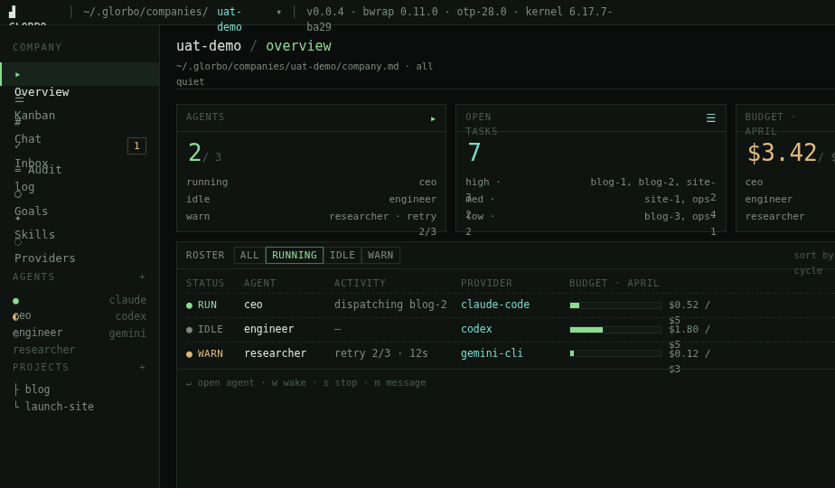

The landing view for a single company. Four KPI cards (Agents, Open
tasks, Budget, Invocations/24h) across the top, each with a sparkline /
progress bar. Tabbed roster below (All / Running / Idle / Warn) shows
every agent with status, activity, provider, budget bar. Right-rail
panels: Org chart (reports_to, derived from each AGENT.md),
Goals/hygiene, Audit tail (last 8 events).

- **Sidebar** rail at 180px, **status bar** at 22px, **chat drawer**
  minimized at 26px (see Components).
- KPI cards auto-wrap at narrow widths; roster stays single-row with
  horizontal scroll rather than reflow.

### 2. Kanban (`V1Kanban` in `v1-screens.jsx`)
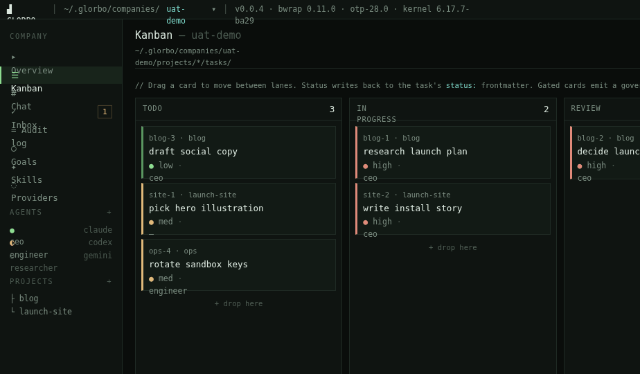

Four columns — TODO / IN PROGRESS / REVIEW / DONE — with task cards
showing id, project tag, title, priority dot, assigned agent. Cards are
draggable; status writes back to the task's YAML frontmatter. Gated
cards emit a governance prompt via Inbox.

### 3. Agent detail (`V1Agent` in `v1-screens.jsx`)
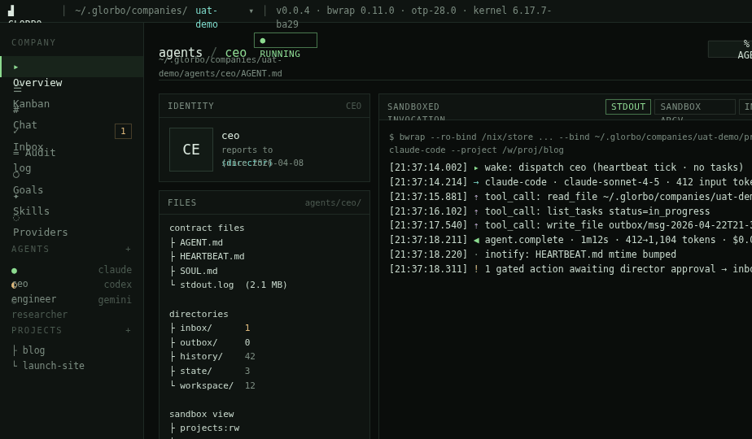

Per-agent deep view. Left: identity (who reports to whom, provider,
working hours, tags, AGENT.md path). Middle: live **chat:read** view of
the agent's own inbox stream, plus a file tree scoped to what the agent
is sandboxed to see. Right: budget, recent invocations, skill load-out.

### 4. Inbox (`V1Inbox` in `v1-screens.jsx`)
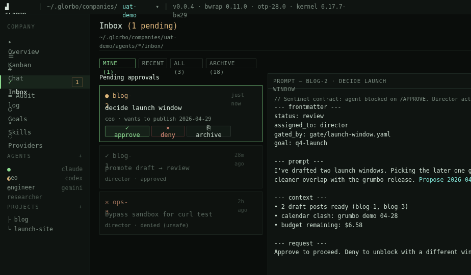

Already exists at `/companies/:co/inbox` (unified per GEP-20 /
v0.0.3 — Mine/Recent/All/Archive tabs). This design **restyles the
existing InboxLive**, it doesn't restructure it:

- Tab bar → monospace, amber-underlined active tab (already the
  semantic color for "approval-gated").
- Row density → tighter (12px font, 28px row height).
- Approve/deny actions → inline chips rather than right-rail buttons;
  `y/d` keyboard shortcuts highlighted.
- Empty state → ASCII "cat watching" with "no pending approvals"
  (shared with the global empty pattern, § 11).

### 5. Audit log (`V1Audit` in `v1-screens.jsx`)
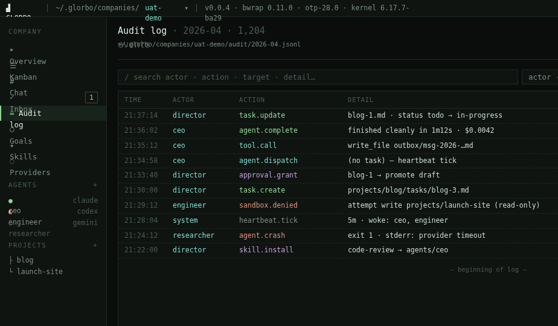

Live tail of `audit/YYYY-MM.jsonl`. Rows render as mono, one line per
event, with `⏵` prefix markers for kind (dispatch / complete / error /
hook). Click a row to expand raw JSON. Filters at top: agent, kind,
time window. Ends with "follow · full log →" which opens the raw file.

### 6. Goals (`V1Goals` in `v1-screens.jsx`)
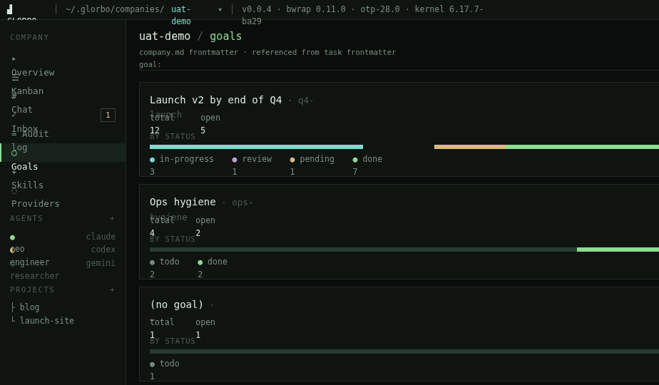

Time-scoped targets ("ship v2 of the blog by end of Q4"). Each goal has
a status (active / paused / done), owner agent, and the task IDs it
rolls up. Rendered as sections, not cards — this is a reading view, not
a planning tool.

### 7. Skills (`V1Skills` in `v1-screens.jsx`)
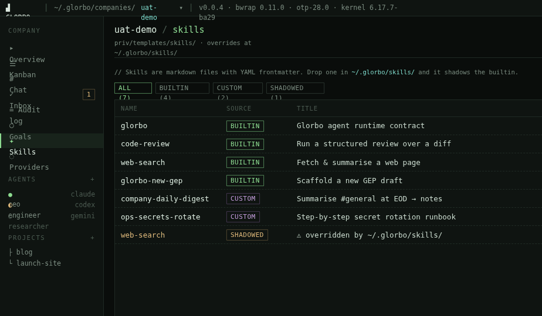

The shared skill library the company has loaded. Each skill: name,
description, scope (which agents can invoke), last-used timestamp.
Click → opens the skill's markdown. This is primarily a reference
screen; add/remove is a filesystem operation, reflected here on reread.

### 8. Providers (`V1Providers` in `v1-screens.jsx`)
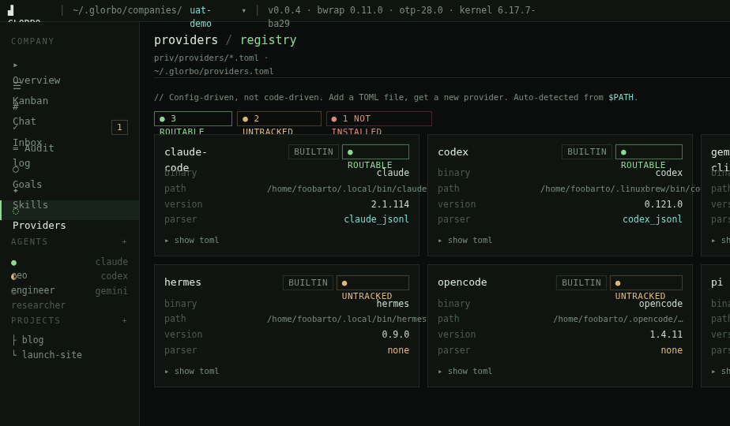

LLM provider config: claude-code / codex / gemini-cli / etc. Per
provider: status, ratelimit headroom, active keys (partially redacted),
cost-per-million-tokens, recent error spike if any.

### 9. Chat · full page (`V1Chat` in `v1-chat.jsx`)
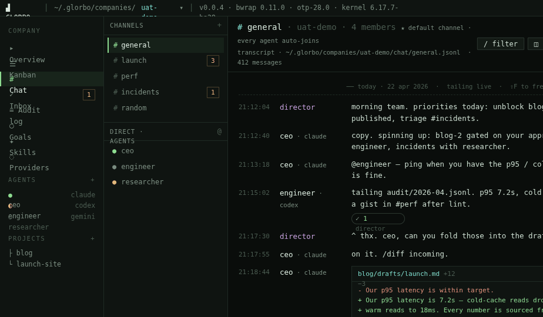

The "you hit `g c`" view of the transcript for `#general`. Three-column:
channel rail (channels + direct DMs + pinned files) · transcript ·
details drawer (topic, members, pinned messages, files mentioned, slash
commands reference). Composer at the bottom is a shell prompt (see
§ Interactions · Composer).

### 10. Company details (`V1CompanyDetails` in `v1-chat.jsx`)
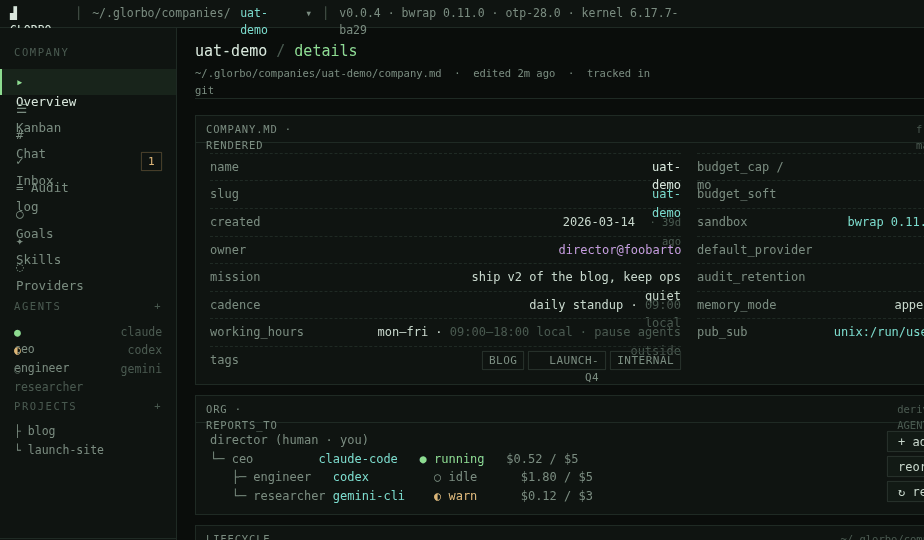

"The one where the drawer is fully expanded." Structured view of
`company.md` (mission, cadence, working hours, budget cap, default
provider, audit retention), the org tree, lifecycle hooks (pre-dispatch
/ post-dispatch / on-error / on-approval / nightly), sandbox default
mounts, git-tracked change history, danger zone (pause, archive). The
bottom chat drawer is **expanded by default on this page** — this is
the only page where the drawer is opened, to demonstrate its full form.

### 11. Empty state (`V1Empty` in `v1-tight.jsx`)
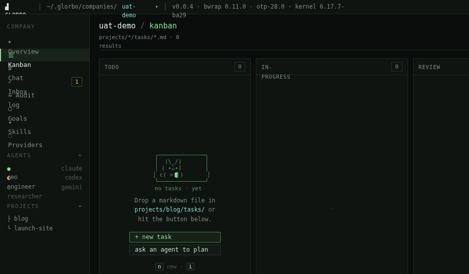

Shown when a page has nothing to display (no tasks, no agents, no
companies). Includes a small ASCII illustration, one sentence of
context, and exactly one "next action" button. No dead ends.

### 12. Loading (`V1Loading` in `v1-tight.jsx`)
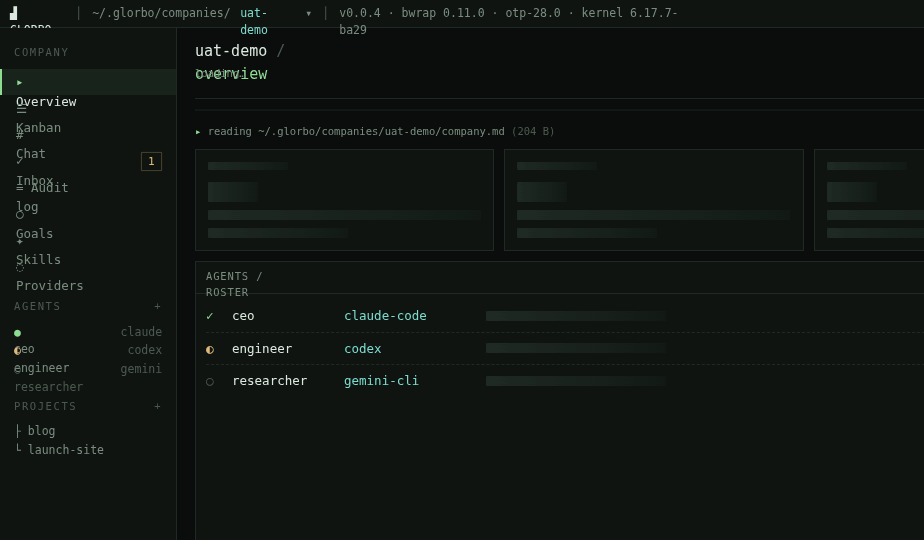

Skeletons, not spinners. Blocks shaped like the real content they'll
replace, dim foreground color, no animation sweep (that's not a
terminal idiom) — just static placeholders with a subtle "[reading…]"
tag at the top.

### 13. Errors (`V1Errors` in `v1-tight.jsx`)
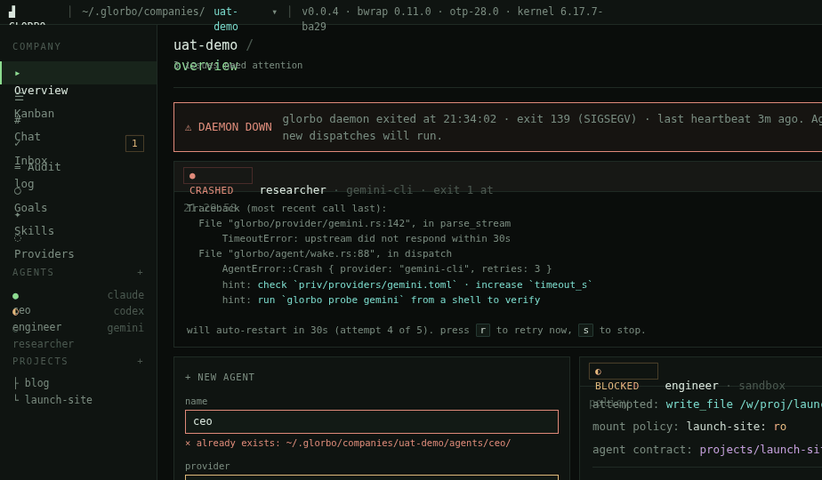

Three concurrent error kinds composed on one canvas to show the
system:
1. **Crashed agent card** — red status, stderr tail, "restart · open
   audit · mark bad" actions.
2. **Denied sandbox** — inline warning in a file tree when an agent
   touched something outside its mount.
3. **Toast stack** — bottom-right, max 3 visible, auto-dismiss on
   resolve, click expands to full event in `/audit`.

### 14. Command palette (`V1Palette` in `v1-tight.jsx`)
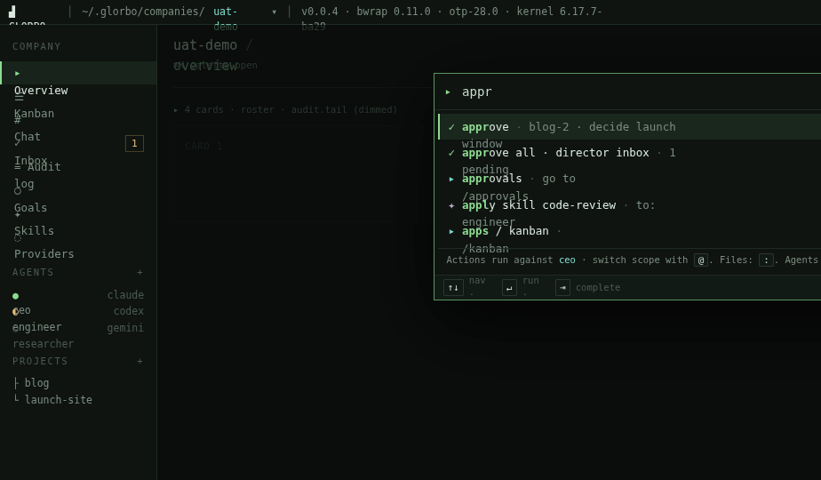

`⌘K` overlay. Fuzzy-match across agents, projects, files, goals, skills,
past commands. Grouped results. "Recently you visited" block at the
bottom. First result always pre-selected; `enter` runs, `tab` pins to
palette history.

### 15. Keyboard overlay (`V1Keys` in `v1-tight.jsx`)
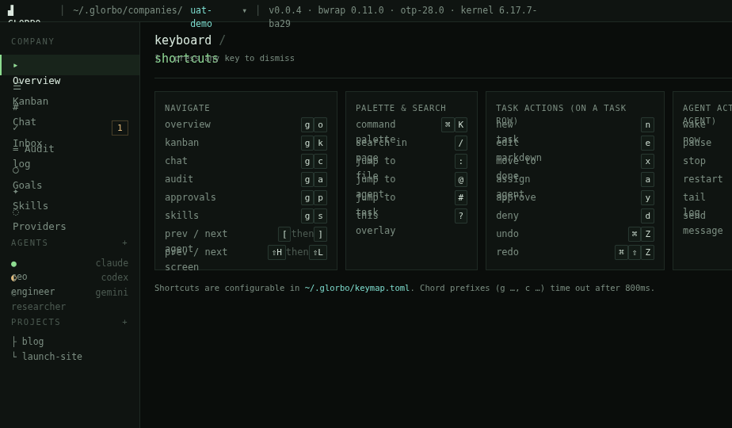

`?` overlay. Keyboard shortcut cheat-sheet, grouped by section. Every
page documents its own shortcuts. See § Interactions · Shortcuts for
the table.

### 16. Confirm · destructive (`V1Confirm` in `v1-tight.jsx`)
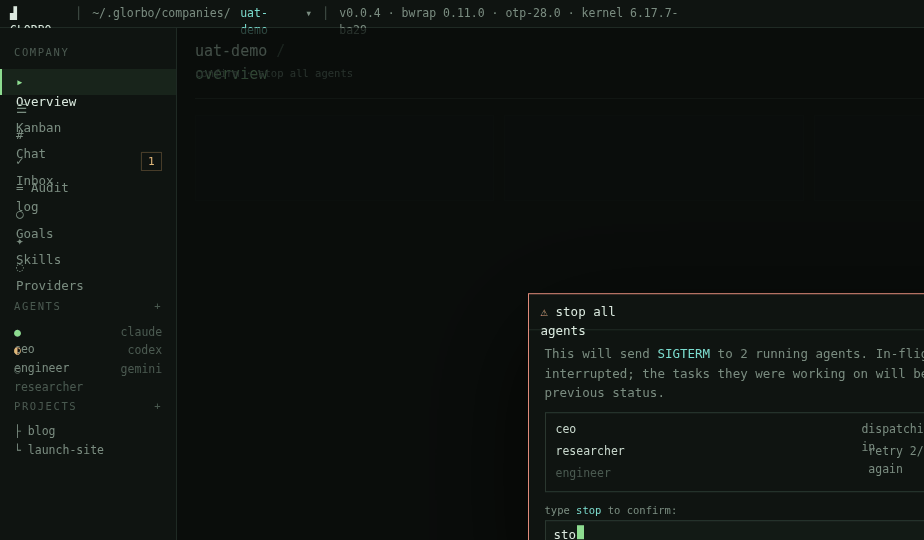

Modal shown before any destructive op (`SIGKILL` agent, archive
company, wipe memory). Requires the user to type the exact word `stop`
(or `archive`, or `wipe`) before the primary button enables — no
muscle-memory mis-clicks.

### 17. Narrow window 640px (`V1Narrow` in `v1-tight.jsx`)
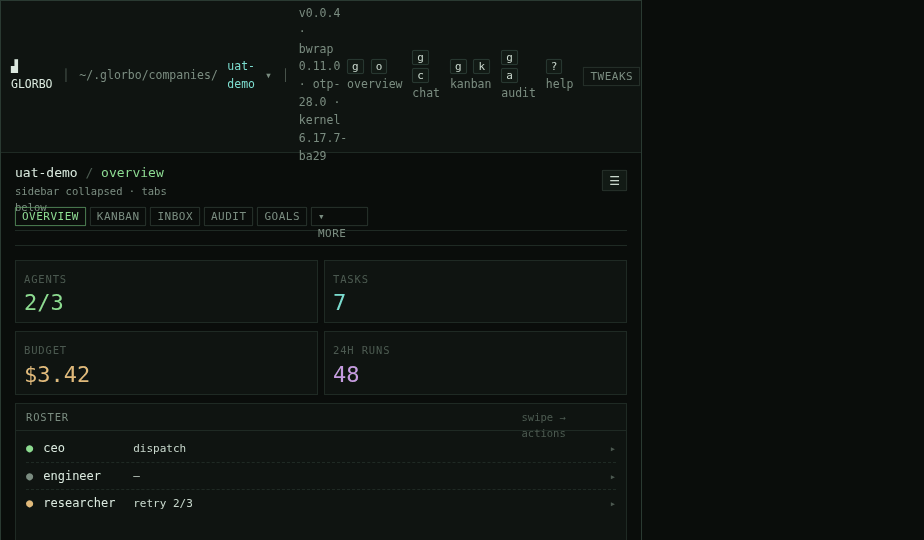

Minimum-supported-width layout. Sidebar collapses to a top tab strip.
KPI cards go 2×2 grid. Right-rail contents fold into an overflow
`≡ more` sheet. Not fully tuned — the decision is "sidebar → tab
strip," but spacing needs a real-device pass.

### 18. 500 · glorbo has fainted (`V1Err500` in `v1-errors-page.jsx`)
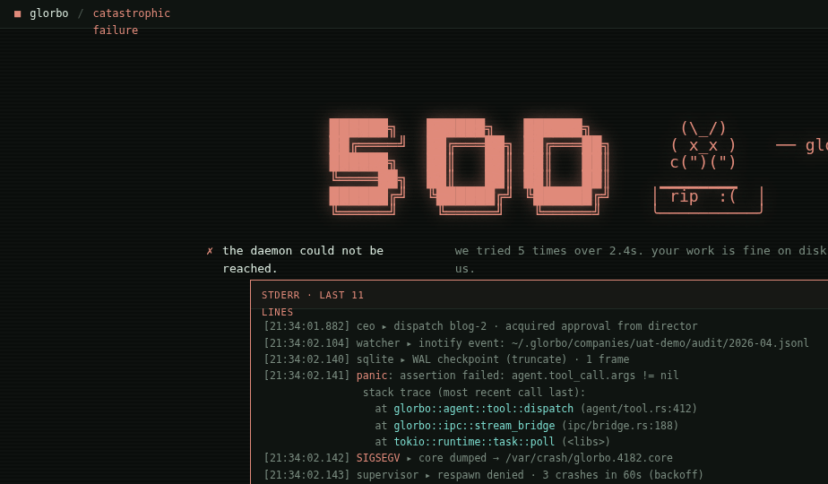

Daemon down / backend unreachable. ASCII cat lying on its back, short
status block showing what's alive (inotify / sqlite / mcp), a big "what
you can do" list (retry now, tail logs, open audit, start in read-only
mode). Not a polished "oops," but a debugging view.

### 19. 404 · path not found (`V1Err404` in `v1-errors-page.jsx`)
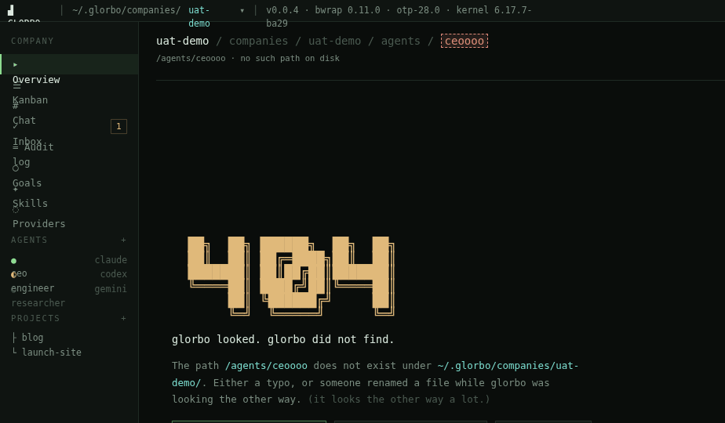

Visited path doesn't exist (deleted company, renamed agent). Renders as
a faked `ls` of what the user expected to find — with the missing
entry highlighted red — plus suggestions ("did you mean…" with
Levenshtein ranking).

## Component inventory

All components live in `source/v1.jsx` unless otherwise noted. Keep the
naming consistent when porting — the prototypes cross-reference each
other by this vocabulary.

### Chrome

#### `TopBar` (`v1.jsx`)
Thin (28px) header bar spanning full viewport. Left: logo glyph +
current company path (`~/.glorbo/companies/<slug>`) with a `▾` picker.
Right: four `g <letter>` keyboard hints and `?` help. Ends with a
TWEAKS pill that the host toolbar respects.

- Background: `--glorbo-bg-2`
- Border-bottom: 1px `--glorbo-line`
- Font: 11.5px mono

#### `Sidebar` (`v1.jsx`)
Left navigation rail at 180px. Two groups: **COMPANY** (Overview,
Kanban, Chat, Inbox, Audit log, Goals, Skills, Providers) and
**AGENTS** (named agents with status dots). Projects pinned at the
bottom. Active item has a 2px green left-border and tinted row
background.

- Background: `--glorbo-bg-2`
- Font: 12px mono
- Unread badge on Inbox: amber pill, right-aligned

#### `StatusBar` (`v1.jsx`)
Bottom 22px strip. Pipe-separated segments: daemon status (green dot +
`alive · uptime Xh`), active agents count, sqlite WAL size, inotify
watch count, mcp state, and far-right user identity + wall clock.

- Background: `--glorbo-bg-2`
- Font: 11px mono

#### `ChatDrawer` (`v1.jsx`)
Bottom drawer above the status bar. Two states:
- **Minimized (default):** 26px bar with `^ uat-demo:#general 2 new ·
  ceo is typing…` on the left and `⌘\` toggle on the right.
- **Expanded (on Company details):** ~260px with channel tabs,
  transcript, and composer. See § Interactions · Composer for the
  composer's shell-prompt treatment.

The drawer is **present on every page** but minimized. Keyboard `⌘\`
toggles.

### Atoms

#### `B` (`v1.jsx`)
Tiny polymorphic text wrapper: `<B c="cyan">path.md</B>`. `c` is one or
more semantic role names (see design-tokens.css § Semantic Role
Reference). Use this everywhere — it's the only vector for color in
the system.

#### `Pill` (`v1.jsx`)
Inline chip with a 1px border. Variants: default, `green`, `amber`,
`red`, `mag`, `active`. Used for task tags, priority, channel chips,
status.

#### `Kbd` (`v1.jsx`)
Inline keyboard chip. Always uppercase symbol or single letter. Used in
hints, shortcut overlay, composer footer.

#### `Box` (implicit — `.box` class in `styles.css`)
Bordered container; default 1px `--glorbo-line`, no radius, no shadow.
`.box-hi` variant bumps the border to `--glorbo-line-2`. Padding via
utility classes (`.p-10`, `.p-12`).

## Interactions & behavior

### Keyboard shortcuts

| Key        | Action                                                        |
|------------|---------------------------------------------------------------|
| `g o`      | Go → Overview                                                 |
| `g c`      | Go → Chat (full page)                                         |
| `g k`      | Go → Kanban                                                   |
| `g a`      | Go → Audit log                                                |
| `g i`      | Go → Inbox                                                    |
| `g g`      | Go → Goals                                                    |
| `g s`      | Go → Skills                                                   |
| `g p`      | Go → Providers                                                |
| `⌘ K`      | Command palette                                                |
| `?`        | Keyboard overlay (this table)                                  |
| `⌘ \`      | Toggle chat drawer (minimize ↔ expand)                         |
| `esc`      | Dismiss overlay / clear composer / exit focus                  |
| `j / k`    | Next / previous row (Inbox, Audit, Kanban column)              |
| `y / d`    | Approve / deny the focused Inbox row                           |
| `h / l`    | Move a focused Kanban card left / right                        |
| `enter`    | Open focused row / run palette result                          |
| `/`        | Focus filter in the current list                               |
| `⌘ ↵`      | Send composer                                                  |
| `⇧F`       | Freeze / unfreeze live-tail transcripts                        |

`g`-prefix shortcuts time out in 800ms if no second key is pressed.
Any modal (palette, keys, confirm) consumes all keys and dims the
background.

### Slash commands (composer)

Typing `/` in the composer triggers a slash-command menu.

| Command                     | Effect                                                    |
|-----------------------------|-----------------------------------------------------------|
| `/dispatch <agent>`         | Wake an agent and attach the rest of the message as input |
| `/approve <task-id>`        | Promote a gated task one stage                            |
| `/assign <agent> <task-id>` | Reassign a task                                           |
| `/skill <name>`             | Scope a skill to this turn                                |
| `/pin`                      | Pin the selected message (or current draft)               |
| `/diff`                     | Paste the CEO's last proposed diff inline                 |

Commands autocomplete and show usage hints to the right of the input.

### Composer (shell prompt)

The composer is rendered as a terminal prompt, not a form field:

```
director@uat-demo:#general$ @ceo when the draft is in review, queue up…█
```

- `director` → `--glorbo-green` (user)
- `@`, `:`, `$` → `--glorbo-fg-mute`
- `uat-demo` → `--glorbo-cyan` (company)
- `#general` → `--glorbo-amber` (channel)
- Typed text → `--glorbo-fg`, wraps naturally to column 0 (no
  indent-continuation — it reads like a real terminal)
- Cursor → 7×14px solid `--glorbo-green` block, 1.05s blink with
  `steps(2)`

The same prompt format is used in both the full Chat page composer and
the minimized-drawer status line (where it reads `uat-demo:#general`
without the `director@`).

### Live updates

The TUI is a view over a filesystem. Phoenix LiveView is already wired
to the inotify-backed `Glorbo.Filesystem.Watcher` — every screen
subscribes to the relevant PubSub topic and re-renders without polling:

- Transcript: `channels/<channel>.md` — append-only markdown, tail latest N
- Audit: `audit/YYYY-MM.jsonl` — append-only, tail latest N
- Roster: `agents/*/agent.md` frontmatter + live stdout streamer
- Budget: computed from `audit/*.jsonl` with a 60s rollup cache
- Kanban: `projects/*/tasks/*.md` frontmatter

Freeze (`⇧F`) pauses tailing so the user can read a snapshot; a
"tailing live" / "frozen" indicator replaces the date line.

### Approval-gated flow

When an agent emits a "request approval" event, it renders as an
inline card in both the transcript and Inbox:

- Amber border (`--glorbo-amber`)
- Title: what's being approved (e.g. "blog-2 · promote draft → review")
- Two buttons: `✓ approve (y)` and `✕ deny (d)`
- After decision: card collapses to one line with outcome + who
  approved + timestamp; the agent resumes from the audit event

### Animations

Terminal-appropriate only:
- Cursor blink (1.05s, 2 steps — no smooth fade)
- Status-dot heartbeat on "running" agents (1.2s pulse)
- Toast auto-dismiss slide-up (180ms)
- Nothing else. No parallax, no hover-lift, no gradient sweep.

## Data shapes

The TUI reflects real files. The on-disk layout is documented in
`docs/file-formats/` in the repo; consult that for authoritative specs
(per v0.0.4's GEP-25, there are 22 `FileSpec` kinds and a `glorbo
validate` command that enforces them). The shapes below are what the
**redesigned views read** — cross-check against the specs before
shipping.

> **Naming:** on-disk filenames are lowercase (`company.md`, `agent.md`,
> `project.md`). ALLCAPS variants (`AGENTS.md`, `HEARTBEAT.md`,
> `SOUL.md`) are **agent-facing** markdown per GEP-15 and render the
> same way in the UI but aren't the primary source of UI data.

### `~/.glorbo/companies/<slug>/company.md`

YAML front-matter plus Markdown body. Front-matter is authoritative.

```yaml
---
name: uat-demo
slug: uat-demo
created: 2026-03-14
owner: director@example.invalid
mission: ship v2 of the blog, keep ops quiet
cadence: daily standup · 09:00 local
working_hours:
  days: [mon, tue, wed, thu, fri]
  start: "09:00"
  end: "18:00"
  outside_behavior: pause
budget_cap_usd: 10.00
budget_soft_alert_pct: 80
tags: [blog, launch-q4, internal]
sandbox:
  runtime: bwrap
  runtime_version: 0.11.0
  policy: default-v3
default_provider: claude-code
audit_retention_days: 90
memory_mode: append-only
pub_sub: unix:/run/user/1000/glorbo.sock
---

(body is freeform markdown — used as the company's description)
```

### `~/.glorbo/companies/<slug>/agents/<name>/agent.md`

```yaml
---
name: ceo
role: ceo
reports_to: director
provider: claude-code
status: running          # running | idle | warn | crashed | paused
budget_usd:
  used: 0.52
  cap: 5.00
skills: [writing, approval-loop]
pinned_files:
  - blog/drafts/launch.md
  - AGENTS.md
sandbox:
  mounts:
    - { path: projects/blog, mode: rw }
    - { path: chat, mode: rw }
    - { path: skills, mode: read }
    - { path: audit, mode: append }
---

(body is the agent's persona / charter, read on every wake)
```

### `~/.glorbo/companies/<slug>/audit/YYYY-MM.jsonl`

One JSON object per line, append-only. Every UI change and every agent
tool call produces an event.

```json
{"t":"2026-04-22T21:15:02Z","kind":"agent.activity","agent":"engineer","action":"tail","args":{"path":"audit/2026-04.jsonl"}}
{"t":"2026-04-22T21:15:03Z","kind":"agent.complete","agent":"engineer","ms":402,"tokens":{"in":1820,"out":240},"cost_usd":0.012}
{"t":"2026-04-22T21:22:10Z","kind":"provider.warn","agent":"researcher","provider":"gemini-cli","msg":"retry 2/3 · timeout"}
{"t":"2026-04-22T21:34:02Z","kind":"daemon.restart","reason":"sigterm","reclaimed_tool_calls":1}
{"t":"2026-04-22T21:36:02Z","kind":"approval.request","agent":"ceo","task":"blog-2","action":"promote","from":"draft","to":"review"}
{"t":"2026-04-22T21:37:14Z","kind":"approval.grant","by":"director","task":"blog-2"}
```

Known `kind` values — your schema will probably grow; these are the
ones the UI knows how to render:

- `agent.dispatch` / `agent.complete` / `agent.error`
- `agent.activity` (tool calls)
- `approval.request` / `approval.grant` / `approval.deny`
- `hook.fire` (e.g. `pre-dispatch`, `post-dispatch`, `on-error`,
  `on-approval`, `nightly`)
- `provider.warn` / `provider.down`
- `daemon.start` / `daemon.restart` / `daemon.shutdown`
- `budget.alert`

### `~/.glorbo/companies/<slug>/channels/<channel>.md`

Append-only **markdown** (not JSONL). Every message is a timestamped
section; Glorbo is the only writer (atomic, permission-checked).
Channel rotation (v0.0.4) archives older segments into
`channels/archive/<channel>/<ts>.md` when size or line thresholds
trip.

```markdown
## 2026-04-22T21:12:04Z · director

morning team. priorities today: unblock blog, published, triage #incidents.

## 2026-04-22T21:12:40Z · ceo (claude-code)

copy. spinning up: blog-2 gated on your approval; engineer, incidents with researcher.

## 2026-04-22T21:18:44Z · ceo (claude-code) [diff blog/drafts/launch.md]

```diff
- Our p95 latency is within target.
+ Our p95 latency is 7.2s — cold-cache reads dropped to 18ms.
```
```

DMs are a reserved channel: `dm-director--<agent>.md`, auto-created on
first `/companies/:co/dms/:agent` visit (see `router.ex`).

### `~/.glorbo/companies/<slug>/projects/<project>/tasks/<id>.md`

Each Kanban card is a file.

```yaml
---
id: blog-2
project: blog
title: research launch plan
status: in-progress     # todo | in-progress | review | done
priority: high          # low | med | high
assignee: ceo
gated: true             # requires approval to advance
created: 2026-04-20
---

(body is the task brief + running agent notes)
```

### `~/.glorbo/companies/<slug>/goals.md`

```yaml
---
goals:
  - id: g1
    title: Launch v2 by end of Q4
    status: active
    owner: ceo
    rolls_up: [blog-1, blog-2, site-1, site-2]
  - id: g2
    title: Ops hygiene
    status: paused
    owner: researcher
    rolls_up: []
---
```

## Design tokens

See `design-tokens.css`. Exact hex values, semantic roles, spacing
scale, and type scale. Drop the file in your codebase and reference
`var(--glorbo-*)` rather than re-picking any color.

## Accessibility notes

- Minimum text size is **11px** (status bar only); body is 12–13px.
  Don't shrink further — the terminal aesthetic tempts it.
- Color is never the only signal for status — every state also uses a
  glyph prefix (`●` running, `○` idle, `◐` warn, `✕` error).
- Focus outlines: use `--glorbo-green-dim` at 1.5px. Don't suppress.
- Keyboard nav is the primary input; every interactive element must
  be tab-reachable.
- The cursor blink uses `steps(2)` (not smooth) — honors
  `prefers-reduced-motion` naturally because it's a toggle, not an
  animation.

## Non-goals / explicit NO

- No dark/light toggle — this is dark-only. The green-on-black IS the
  product.
- No rounded corners on any surface (only `.kbd` chips and the `Pill`
  component get `--glorbo-radius-pill`).
- No drop shadows, glows, or gradients.
- No emoji (except the ASCII-art mascot on empty/500/404 pages).
- No sans-serif anywhere — the whole UI is monospace.
- No icon library — glyphs are Unicode box-drawing and single characters
  (`●`, `○`, `◐`, `▸`, `└─`, `├─`, `─`, `│`, `✓`, `✕`, `▾`).

## Files in this bundle

```
design_handoff_glorbo_tui/
├── README.md                    ← this file
├── design-tokens.css            ← exact hex values + semantic roles
├── screenshots/                 ← PNG of every artboard (19 files)
│   ├── 01-company-dashboard.png
│   ├── …
│   └── 19-err404.png
└── source/                      ← HTML/JSX prototypes (reference only)
    ├── Glorbo Redesign.html     ← entry point · design_canvas wrapper
    ├── styles.css               ← shared stylesheet
    ├── v1.jsx                   ← chrome (TopBar/Sidebar/StatusBar/ChatDrawer) + atoms
    ├── v1-screens.jsx           ← Overview / Kanban / Agent / Inbox / Audit / Goals / Skills / Providers
    ├── v1-tight.jsx             ← edge states + polished overview
    ├── v1-errors-page.jsx       ← 500 / 404
    ├── v1-chat.jsx              ← Chat full page + Company details
    └── design-canvas.jsx        ← prototype harness (DO NOT COPY)
```

To run the prototypes locally: serve the `source/` folder with any
static HTTP server and open `Glorbo Redesign.html`.

## Implementation order (suggested)

1. **Tokens** — merge `design-tokens.css` into `assets/css/app.css`
   under a `/* TUI tokens */` heading. Replace existing OKLCH vars
   where they overlap; keep the old names as aliases if they're
   referenced widely.
2. **Chrome** — `topbar.ex`, `sidebar.ex`, `statusbar.ex`,
   `chat_drawer.ex`. These render on every LiveView; land them
   together so all pages shift consistently on deploy.
3. **CompanyLive** (`/companies/:co`) — validates the KPI card +
   roster pattern that repeats on other pages.
4. **ChannelLive** (`/companies/:co/channels/:channel`) — the
   composer + slash commands + approval cards + diff rendering are
   reused by the minimized drawer.
5. **AuditLive** — the jsonl-tail pattern is reused by the
   live-transcript in Chat.
6. **KanbanLive / InboxLive / AgentLive** — they share the
   focus/keyboard-row-nav pattern.
7. **GoalsLive / SkillsLive / ProvidersLive** — simpler reading
   views.
8. **Edge states** — empty / loading / errors / 404 / 500. One
   shared layout; wire into every LiveView's empty clauses.
9. **Overlays** — command palette (`⌘K`), keys (`?`), confirm modal.
   New components; wire global shortcuts in `assets/js/`.

## Contact / open questions

Open in the prototype canvas (`Glorbo Redesign.html`, "Next steps"
post-it):

- Chat drawer default state — minimized everywhere, or only off
  ChannelLive?
- Prompt format — `director@uat-demo:#general$` vs
  `director@uat-demo:~/chat/general$`?
- Hooks surface — on Company details (drawer-expanded view), or a
  new `/companies/:co/hooks` route?
- Ship narrow-window (640px) layout, or desktop-only? The repo
  README says "WSL2 / Linux" — mobile is almost certainly out of
  scope, but tablet / small laptop is not.
- Do we want to collapse `/goals` and `/skills` into CompanyLive
  tabs? They feel thin as standalone pages.
