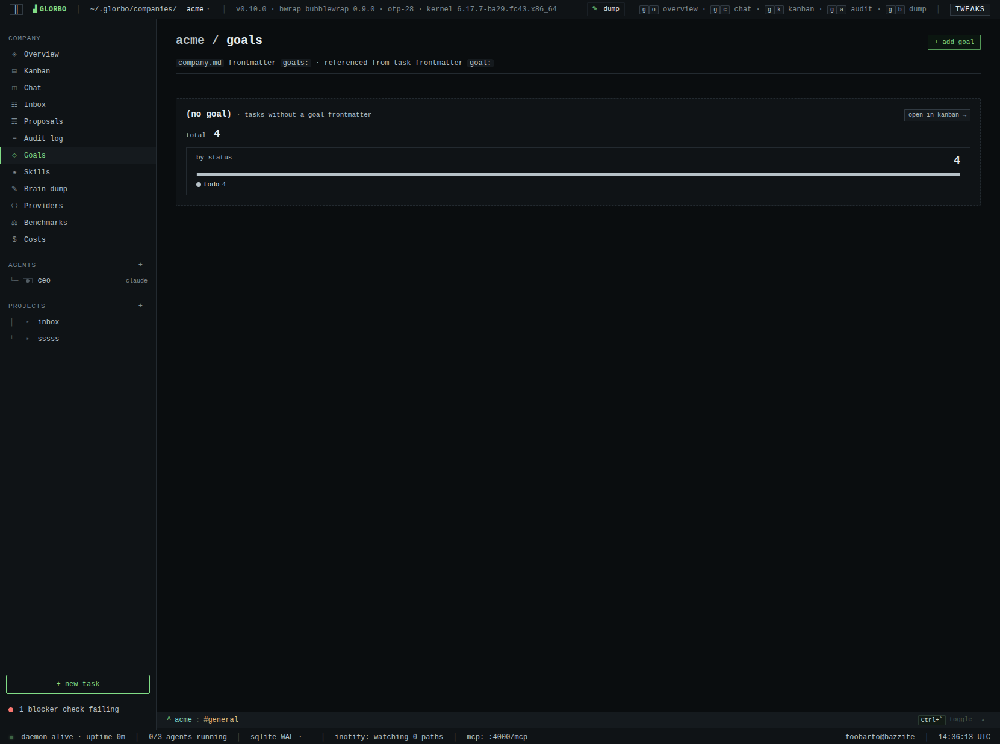
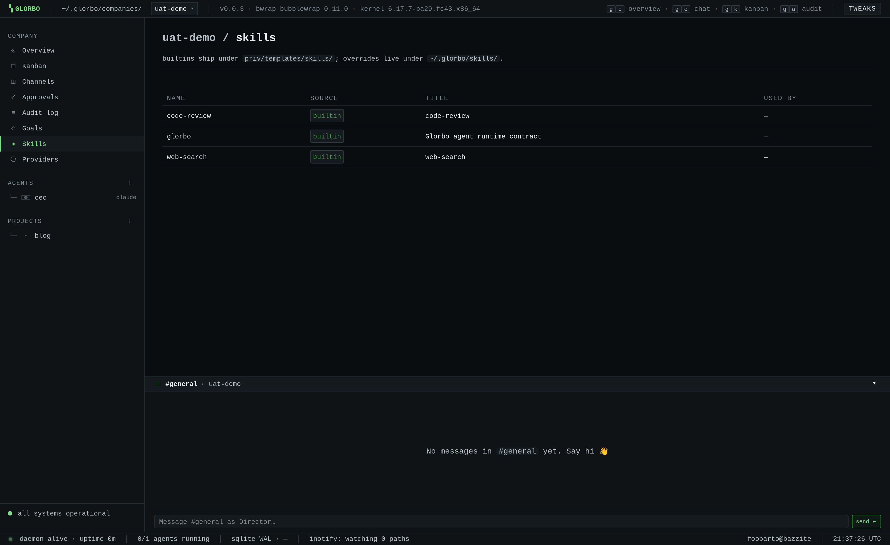
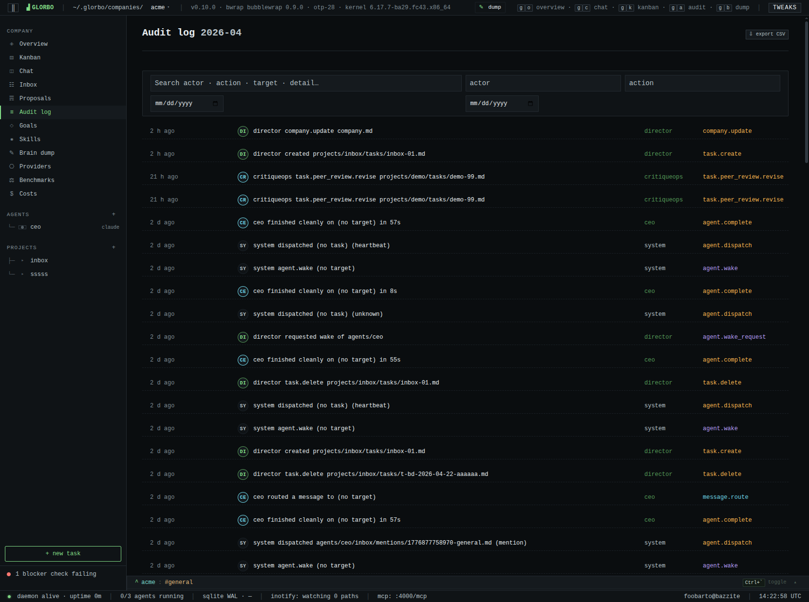
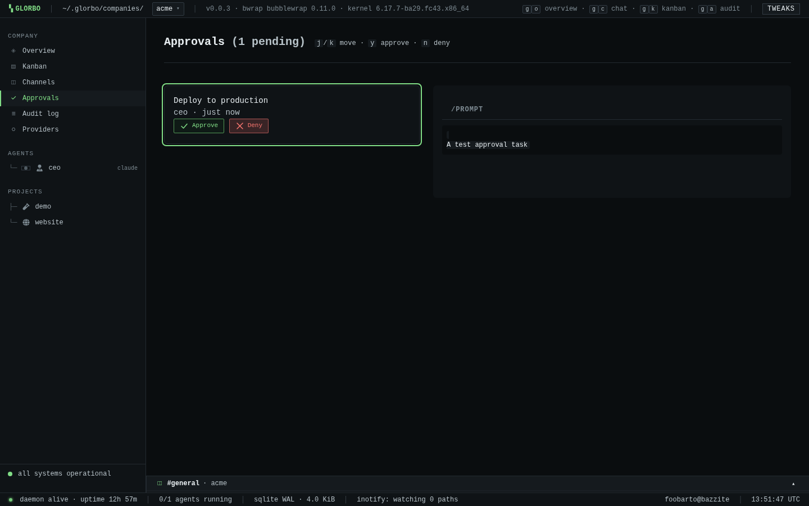

<p align="center">
  
</p>

<p align="center">
  <a href="https://github.com/foobarto/glorbo/actions/workflows/ci.yml"></a>
  <a href="https://github.com/foobarto/glorbo/releases/latest"></a>
  <a href="LICENSE"></a>
  <a href="https://elixir-lang.org"></a>
  <a href="https://erlang.org"></a>
  <a href="#"></a>
  <a href="SECURITY.md"></a>
  <a href="CONTRIBUTING.md"></a>
  <a href="https://github.com/foobarto/glorbo/commits/main"></a>
</p>

# Glorbo

> *Finally, a grumbo-compatible agent orchestrator. The fleeb juice is included.*

Glorbo is a self-hosted agent orchestration platform that models companies as
real organisations — with org charts, goals, budgets, governance, and
communication — and runs AI agents as employees inside kernel-level sandboxes.

**Like Obsidian, but for your agents.** Everything is markdown. Everything is a
file. Everyone has a Glorbo in their home directory.

---

## What Is This

You define a company. You hire agents. You give them jobs. They do the jobs.
They talk to each other through chat channels and task boards. You supervise
from a real-time dashboard. If something goes wrong, you check the markdown
files — because that's all there is.

No cloud. No SaaS. No Kubernetes. No database cluster. Just a folder, some
sandboxes, and an Elixir process that keeps the office running.

```
~/.glorbo/
├── glorbo                    # Single binary. That's the app.
├── glorbo.db                 # SQLite index. Rebuildable. Disposable.
└── companies/
    └── acme/
        ├── company.md        # Mission, budget, settings
        ├── agents/
        │   ├── ceo/
        │   │   ├── agent.md  # Identity, permissions, model config
        │   │   ├── inbox/    # Tasks and messages land here
        │   │   ├── outbox/   # Agent writes here, Glorbo routes
        │   │   └── workspace/
        │   └── engineer/
        ├── channels/
        │   ├── general.md    # Append-only chat logs
        │   └── engineering.md
        ├── projects/
        │   └── website-redesign/
        │       ├── project.md
        │       └── tasks/
        └── audit/
            └── 2026-04.jsonl # Append-only. Never modified. Never deleted.
```

Back up with `tar`. Version-control with `git`. Move to another machine with
`scp`. Debug with `cat`.

## Screenshots

<table>
  <tr>
    <td></td>
    <td></td>
  </tr>
  <tr>
    <td align="center"><sub><code>/companies</code> — overview grid with inline slug-availability probe</sub></td>
    <td align="center"><sub><code>/companies/&lt;co&gt;</code> — 14-day rollups: runs / success rate / tasks by status / by priority</sub></td>
  </tr>
  <tr>
    <td></td>
    <td></td>
  </tr>
  <tr>
    <td align="center"><sub><code>/companies/&lt;co&gt;/kanban?goal=&lt;slug&gt;</code> — goal-scoped board</sub></td>
    <td align="center"><sub><code>/companies/&lt;co&gt;/agents/&lt;slug&gt;</code> — runs tab w/ tool-call counts, inline config edit</sub></td>
  </tr>
  <tr>
    <td></td>
    <td></td>
  </tr>
  <tr>
    <td align="center"><sub><code>/companies/&lt;co&gt;/goals</code> — goal-scoped task rollups (v0.0.3)</sub></td>
    <td align="center"><sub><code>/companies/&lt;co&gt;/skills</code> — builtin + custom skills with used-by counts (v0.0.3)</sub></td>
  </tr>
  <tr>
    <td></td>
    <td></td>
  </tr>
  <tr>
    <td align="center"><sub><code>/companies/&lt;co&gt;/inbox</code> — Mine / Recent / All / Archive (v0.0.3)</sub></td>
    <td align="center"><sub><code>/companies/&lt;co&gt;/audit</code> — <em>&lt;actor&gt; &lt;verb&gt; &lt;object&gt;</em> sentence rendering + avatars</sub></td>
  </tr>
  <tr>
    <td></td>
    <td></td>
  </tr>
  <tr>
    <td align="center"><sub><code>/companies/&lt;co&gt;/approvals</code> — prompt diff · <kbd>j</kbd>/<kbd>k</kbd>/<kbd>y</kbd>/<kbd>n</kbd></sub></td>
    <td align="center"><sub><code>/providers</code> — config-driven provider registry (GEP-8, GEP-32 phase 2a)</sub></td>
  </tr>
</table>

Terminal phosphor aesthetic throughout — monospace, OKLCH tokens,
lowercase-slash panel headers. No JS framework, no build step for the
CSS.

## Features

**Filesystem-first architecture** — Agents, tasks, chat, permissions, goals,
and audit logs are all markdown and JSONL files on disk. SQLite exists only as
a rebuildable index for dashboard queries. Delete it anytime; `glorbo reindex`
brings it back in seconds.

**Kernel-sandboxed agents** — Every agent wake is a fresh `bwrap`
sandbox: `--unshare-user-try --unshare-ipc --unshare-pid --unshare-net
--die-with-parent --cap-drop ALL`. The workspace is `--bind`-mounted writable;
nothing else is visible. Network isolation is kernel-enforced, not
policy-enforced.

**CLI-tool agents** — Use the Claude Code, Gemini CLI, Codex, or other
registered CLI installs already on your machine. Their credentials are
`--ro-bind`ed into the sandbox; session state stays on the host.

**Native OpenAI-compatible providers (v0.2.0, GEP-32 phase 2a)** —
OpenAI and OpenRouter now run through a first-party `glorbo harness`
subcommand inside the same bwrap sandbox. The shipped native tool loop
now covers `read_file`, `write_file`, `edit_file`, `glob`, and `grep`,
and those tool calls replay into the company audit log. Native usage is
still metered through Glorbo-owned `usage.json`; providers that omit
token telemetry remain gated behind `allow_untracked_budget: true`.
Credentials live outside `~/.glorbo/` in
`~/.local/etc/glorbo/credentials/<provider>.toml`, so naïve backups of
`~/.glorbo/` do not sweep API keys into archives.

**Config-driven providers (GEP-8, extended in GEP-32 phase 2a)** — Each
provider is a TOML entry declaring either how to invoke a CLI or how a
native OpenAI-compatible endpoint should be reached and metered.
Built-in providers ship under `priv/providers/*.toml`; drop your own
into `~/.glorbo/providers.toml`. The `/providers` LiveView shows what's
routable. Native entries can declare endpoint, auth mode, usage parser,
and model-list shape. No Elixir code is needed to register a new
provider.

**Local-first LLMs** — Agents use whichever runtime you have: a host CLI
(`claude`, `gemini`, `codex`, and OSS alternatives like `opencode`,
`hermes`, `pi`) or a native OpenAI-compatible endpoint. Add a local
model by installing its CLI or exposing a compatible endpoint. No
bundled Python runtime, no in-process SDK layer.

**Reply-file contract (v0.0.3, GEP-8)** — Every sandboxed invocation
ends with Glorbo reading the file at `$GLORBO_REPLY_PATH`. Agents
scaffolded by `glorbo new agent` are pre-populated with a system prompt
that instructs the CLI to write its final answer there. Failures
(missing / empty / too-large) surface as structured dispatch errors
in the audit log.

**Real-time dashboard** — Phoenix LiveView at `http://127.0.0.1:4000`
provides company overview, kanban board, agent monitoring with stdout
streaming, chat, approval queue, audit viewer, system health, and a
provider-registry panel at `/providers` (v0.0.3). Inotify events
repaint the UI in under a second with no polling. No JavaScript
framework. No build step.

**Director-centric surfaces (v0.0.3, GEP-20)** — Unified `/inbox`
with Mine/Recent/All/Archive tabs aggregating approvals + audit
activity; dedicated `/goals` page roll-up per company-declared
goal; `/skills` bundle view listing builtin + user-override
skills with used-by counts; inline AgentLive config edit form
that writes AGENT.md frontmatter in place; 14-day rollup strip
on every company dashboard (runs / success rate / tasks by
status / by priority); two-letter actor avatars on audit,
channel, and inbox rows; inline slug-availability probe on the
new-company modal; `⌘K` command palette with per-company
destinations + director actions; tool-call counts on Claude-Code
runs (`Bash×1, Read×2` on the Runs tab).

**Director safety + speed (v0.0.3-dev, loop session)** —
**Emergency stop** (topbar kill switch that halts every running
dispatch and refuses new ones until cleared);
**cost ledger** at `/costs` showing per-agent monthly spend for
the last 12 months; **Ctrl+K content search** covers task titles
across the focused company (cached by mtime); **brain dump**
surface (`g b`) captures throwaway thoughts into a daily log and
converts any entry to a task; **recurring tasks** (`schedule:`
frontmatter with cron or `hourly`/`daily`/`weekly`/`monthly`
aliases) fire scheduled dispatches via a per-company
`TaskScheduler`, auto-reset to `todo` on `done`, and render a
`↻` pill on the kanban; **chat rotation** archives channel logs into
`channels/archive/<channel>/<ts>.md` when size / line thresholds
trip, with an in-page archive browser; **per-task model /
provider override** and **named model aliases** on agents let
one task pin a specific LLM without editing the agent;
**natural-language heartbeat** compiles `"every morning at 9am"`
to cron at parse time; **per-task audit history panel** on every
task page shows a live-refreshing slice of the audit log scoped
to that task (dispatch / retry / scheduled-fire / update) with a
deep-link into the full audit view pre-filtered to the task id.

**Agent chat** — Talk to your agents. Agents talk to each other. Channels are
append-only markdown files underneath. Phoenix Channels handles real-time
delivery.

**Company isolation** — Each company's data lives in its own directory under
`~/.glorbo/companies/`. The bwrap sandbox bind-mounts only the active
company's directory; sibling companies are simply not in the mount list.

**Permission model** — Declared in markdown frontmatter, enforced at two
layers by design: the Elixir Router (application) and the Linux kernel
via `bwrap` mount namespaces. An agent without `projects:write:foo`
literally cannot write there.

**Budget governance** — Per-agent AND per-company monthly budgets
declared in markdown frontmatter (`budget_usd_cents_month:` on
`AGENT.md` or `company.md`). Dispatch refuses new work at 100%,
warns at 80%. No runaway API bills at 3 AM.

**Approval gates** — Tasks can require Director approval before execution.
The agent pauses, you review, one click to approve.

**OTP supervision** — If an agent crashes, only that agent restarts. If a
company crashes, only that company's agents restart. The dashboard and other
companies are unaffected. That's just what the BEAM does.

**Portable** — Deploy by copying a binary. Upgrade by replacing it. Move by
tarring the directory. The BEAM VM is bundled in the release via Burrito.
`glorbo backup` → `scp` → `glorbo restore` + `glorbo doctor --fix` reproduces
a functional install on a fresh host (verified end-to-end by
`test/integration/portability_test.exs`).

## Quick Start

### Prerequisites

- Linux (x86_64 or aarch64)
- `bubblewrap` (`bwrap`) — available in every major distro's package manager
- `inotify-tools`
- On Ubuntu 24.04 / Debian 13, an unconfined AppArmor profile for
  `/usr/bin/bwrap` (the kernel blocks unprivileged user-namespace network
  operations otherwise; see `.github/workflows/ci.yml` for the canonical
  profile).
- At least one provider runtime:
  - a supported CLI installed and authenticated (`claude`, `gemini`,
    `codex`, `opencode`, etc.), or
  - a native credentials file for a built-in/provider-registry native
    endpoint such as `openai` or `openrouter`.

No Python. No Erlang. No Node.js. `glorbo init` verifies the rest and
bootstraps `~/.glorbo/`.

### Install

**Homebrew (Linux — x86_64 and aarch64):**

```bash
brew tap foobarto/tap
brew install glorbo
glorbo init
```

**Manual (direct binary):**

```bash
curl -L https://github.com/foobarto/glorbo/releases/latest/download/glorbo-linux-$(uname -m) \
  -o ~/.local/bin/glorbo
chmod +x ~/.local/bin/glorbo

glorbo init
```

**macOS** (Intel + Apple Silicon) binaries ship alongside Linux
builds since v0.0.4 (R30). `bwrap` is not available on macOS, so
agent execution falls back to unsandboxed mode with a one-time
`agent.sandbox_unavailable` audit warning per company boot. All
other features (dashboard, routing, scheduling, approval gates)
work unchanged. Install via the same Homebrew tap:

```bash
brew tap foobarto/tap
brew install glorbo
```

**Windows** is supported via [WSL2](https://learn.microsoft.com/en-us/windows/wsl/install).
The Linux binaries above run unchanged inside a WSL2 distro
(Ubuntu, Fedora, etc.) — that's the supported way to run Glorbo
on a Windows host. There are no native Windows builds and none
are planned; the agent runtime depends on Linux kernel primitives
(bwrap sandboxing, inotify, user namespaces) that don't have
useful Windows equivalents.

`glorbo init` creates the directory hierarchy, verifies prerequisites via
`glorbo doctor`, and optionally scaffolds an example company.

### Native provider quick setup

You do **not** need a separate CLI install to run the built-in native
providers. For OpenAI or OpenRouter, create a credentials file on the
host:

```bash
mkdir -p ~/.local/etc/glorbo/credentials
chmod 700 ~/.local/etc/glorbo/credentials
```

```toml
# ~/.local/etc/glorbo/credentials/openai.toml
api_key = "sk-..."

# optional: override the built-in endpoint
# endpoint = "https://api.openai.com/v1"
```

```toml
# ~/.local/etc/glorbo/credentials/openrouter.toml
api_key = "sk-or-v1-..."
```

Then point an agent at `provider: openai` or `provider: openrouter` in
`AGENT.md`. The current native tool catalog is:

- `read_file`
- `write_file`
- `edit_file`
- `glob`
- `grep`

Those tools run inside the same sandbox mount view as CLI-backed agents,
and their activity is replayed into the company audit log. The next
native-tools tranche is `bash` + `web_fetch`; they are not shipped in
`v0.2.0`.

### Local development

Build, run, and iterate on the code without touching the shipped binary.

**Prerequisites (dev-only, on top of the runtime ones above):**

- Elixir 1.18.4 / OTP 28.0.2 — pinned in `.tool-versions`; the recommended
  way to get them is [mise](https://mise.jdx.dev):
  ```bash
  mise install   # reads .tool-versions, installs both
  mise activate bash  # or zsh; add to your shell rc
  ```
- A C toolchain for native NIFs (`build-essential` / `base-devel` /
  equivalent).
- `inotify-tools` on the host — the LiveView watcher needs it for
  sub-second UI refresh.

No Node.js, no npm. Esbuild is shipped as a Hex package and runs
through `mix assets.build`.

**Clone + bootstrap:**

```bash
git clone https://github.com/foobarto/glorbo && cd glorbo
mix setup   # fetches deps, creates/migrates dev DB, installs esbuild
```

**Run the dev server:**

```bash
mix phx.server
# Dashboard at http://localhost:4000, live-reloaded on file change.
```

Dev-mode data lives in `~/.glorbo/`; the dashboard reads the same
filesystem as the installed binary. Scaffold a test company with
`mix run -e 'Glorbo.Init.run([])'` or — easier — invoke the CLI
subcommands directly from iex:

```bash
iex -S mix phx.server
# iex> Glorbo.CLI.dispatch(["new", "company", "acme"])
```

**Test + lint gates:**

```bash
mix test                 # full suite; creates/migrates test DB first
mix credo --strict       # zero-findings bar; CI fails on exit code 8
mix format --check-formatted
mix precommit            # compile --warnings-as-errors + format + test
```

Run `mix precommit` before pushing non-trivial changes — CI runs the
same gates and refuses red.

**Build a release:**

```bash
mix release              # Burrito-wrapped single binary → burrito_out/
```

The release binary embeds the BEAM runtime and is the same shape the
GitHub release ships.

**Project layout at a glance:**

| Path                        | What                                                    |
| --------------------------- | ------------------------------------------------------- |
| `lib/glorbo/`               | Kernel, CLI, agent runtime, filesystem, budget, doctor  |
| `lib/glorbo_web/`           | Phoenix endpoint, router, LiveViews, components         |
| `priv/providers/*.toml`     | Bundled provider manifests (CLI + native)               |
| `assets/css/` + `assets/js/` | Dashboard styles + the small JS bundle (hooks + shortcuts) |
| `docs/geps/`                | Design decision records — start with GEP-1              |
| `test/`                     | ExUnit suite, integration tests tagged `:integration`   |
| `CLAUDE.md`                 | Codebase invariants + common commands (load-bearing)    |

**Agent-runtime dev loop:**

Agent dispatch needs `bwrap` and either a provider CLI or a native
provider credentials file configured on the host. From inside
`iex -S mix phx.server`:

```elixir
# Poke the provider registry
Glorbo.CLI.Registry.list()

# Wake an agent (writes state/wake-request.md, the supervisor picks up)
GlorboWeb.Actions.wake_agent("acme", "ceo", "dev smoke test")
```

Stdout streams into the `/companies/acme/agents/ceo` LiveView. Every
invocation appends to `audit/YYYY-MM.jsonl` — check that file if you
don't see what you expect in the dashboard.

For native providers, the same dev loop applies: the sandboxed runtime
is still the Glorbo binary, just invoked as `glorbo harness ...` with
the provider contract passed in via env and bind-mounted credentials.

### Verify

```bash
glorbo doctor
```

Reports on the full dependency chain: kernel version, `uidmap`, disk space,
`~/.glorbo/` layout, ERTS, bwrap, user namespaces, installed CLI tools
(Claude Code, Gemini CLI, Codex, etc.), and tar-zstd.

### Hire an Agent

Edit `~/.glorbo/companies/acme/agents/ceo/agent.md`:

```markdown
---
name: CEO
role: Chief Executive Officer
provider: claude-code            # claude-code | gemini-cli | codex | openai | openrouter
model: claude-opus-4-6           # Provider-specific
budget:
  monthly_usd: 100.00
heartbeat: "*/30 * * * *"
network: proxy                   # none | proxy | open
permissions:
  - projects:read:*
  - projects:write:*
  - tasks:create:*
  - agents:message:*
  - chat:write:*
---

You are the CEO of {{ company.name }}.
Your mission: {{ company.mission }}
```

### Start

```bash
glorbo up              # Detached daemon — dashboard at http://127.0.0.1:4000
glorbo status          # Check daemon pid + uptime
glorbo logs acme ceo --follow
glorbo down            # Graceful SIGTERM → 10s grace → SIGKILL escalation
```

## CLI Reference

All verbs from `docs/DESIGN.md` §10 are wired; the shipped surface as of v0.2.0:

```
glorbo init [--force] [--skip-pull] [--example|--no-example]
                                  Bootstrap ~/.glorbo/ and verify deps
glorbo up                         Start detached daemon (dashboard + supervision)
glorbo down                       Graceful shutdown via SIGTERM → SIGKILL
glorbo status                     Pidfile state + uptime
glorbo serve                      Foreground-blocking supervision (for systemd)
glorbo run <script>               One-shot script execution
glorbo new company <slug>         Scaffold a new company directory
glorbo new agent <co>/<slug>      Scaffold a new agent (--template supported)
glorbo new project <co>/<slug>    Scaffold a new project
glorbo new skill <co> <name>      Scaffold a new skill (--template supported)
glorbo templates list [kind]      List agent/skill templates (GEP-10)
glorbo templates show <kind> <name>
                                  Print a template's contents
glorbo import paperclip <src>     Import a paperclip.ai agentcompanies tree
glorbo logs <co> [agent] [--follow]
                                  Tail audit log or agent stdout (inotify-backed)
glorbo doctor [--json] [--fix]    Verify host prerequisites; 7 auto-fixers
glorbo reindex                    Rebuild SQLite index from filesystem
glorbo migrate                    Run pending Ecto migrations
glorbo backup [--output <path>]   tar.gz of ~/.glorbo/ with WAL checkpoint
glorbo restore <archive> [--force]
                                  Extract + migrate + reindex + doctor --fix
glorbo console                    iex --remsh into the running daemon
glorbo harness ...                Internal native-provider runtime (GEP-32)
glorbo help                       Print usage
```

## How It Works

### The Director

You are the **Director**. You own the company. You hire agents, set the
mission, approve budgets, and intervene when needed. The CEO agent works for
you, not the other way around.

### Communication

**Inbox/Outbox** — An agent writes a markdown file to its `outbox/`. Glorbo
picks it up via `inotify`, checks permissions, and delivers it to the
recipient's `inbox/` or appends it to a channel. Agents never touch each
other's files directly — the Elixir Router mediates every transfer.

**Channels** — Append-only markdown files. Every message is a timestamped
section. Glorbo is the only writer (atomic, permission-checked). The
dashboard renders them as real-time chat.

### Execution

1. An event triggers an agent (new inbox item, heartbeat, channel mention).
2. Glorbo composes a bwrap argv for the agent's declared permissions,
   network policy, and provider runtime.
3. `Port.open/2` invokes `bwrap` with the prompt fed on stdin from a
   tempfile; either an external CLI tool (`claude -p`, `gemini -p`,
   `codex exec -`) or the internal `glorbo harness` runs inside the
   sandbox.
4. The runtime writes its final reply to the Glorbo reply-file contract;
   native providers additionally emit structured `usage.json`
   telemetry, and the native tool loop may read/write the workspace
   before producing the final answer.
5. Glorbo detects the output via inotify, routes messages, updates the
   index, appends to the audit log, and records token usage against the
   agent's budget.
6. The sandbox exits.

Today the native harness owns the filesystem tool batch
`read_file` / `write_file` / `edit_file` / `glob` / `grep`. Each tool
result is counted in usage telemetry, and replayable tool-audit events
flow back through `Agent.Dispatch` so Director-visible audit state
captures native tool activity rather than only the final reply.

### Sandboxing

Every agent wake is a short-lived `bwrap` process:

- Baseline: `--die-with-parent --unshare-user-try --unshare-ipc --unshare-pid
  --unshare-uts --unshare-cgroup-try --new-session --cap-drop ALL`.
- Root filesystem: `--ro-bind /usr /usr`, merged-/usr symlinks, minimal
  `/etc` (resolv.conf, hosts, passwd, group, ssl certs) on top of a
  `--tmpfs /etc`.
- Agent-owned: workspace bind-mounted `rw`, outbox `rw`, inbox `ro`.
- Per-permission mounts spliced in from the `agent.md` frontmatter.
- CLI provider credentials (`~/.claude`, `~/.config/gemini`,
  `~/.codex`) or native credentials
  (`~/.local/etc/glorbo/credentials/<provider>.toml`) bind-mounted `ro`,
  redirected via per-provider env (`CLAUDE_CONFIG_DIR`, `CODEX_HOME`,
  `GLORBO_NATIVE_CREDENTIALS_PATH`).

Network policy:

```
network: none        # --unshare-net (kernel-enforced egress block)
network: proxy       # Inherits host netns; HTTP(S)_PROXY points at an
                     #   allowlisted hostname proxy (advisory)
network: open        # Inherits host netns; no proxy
```

### Permissions

Declared in `agent.md`, enforced at two layers:

```yaml
permissions:
  - projects:read:*
  - projects:write:website-redesign
  - tasks:create:website-redesign
  - agents:message:cto
  - chat:write:engineering
  - tools:execute:code-runner
  - budget:read:self
```

The kernel layer is the bwrap argv: denied paths aren't bind-mounted.
The application layer (Elixir Router) validates cross-directory
transfers as belt-and-braces above the kernel.

## Tech Stack

| Component      | Technology                  | Why                                             |
|----------------|-----------------------------|-------------------------------------------------|
| Orchestration  | Elixir/OTP                  | Supervision trees, fault tolerance, concurrency |
| Dashboard      | Phoenix LiveView            | Real-time UI, no JS framework                   |
| Agent Chat     | Phoenix Channels            | WebSocket pub/sub, built-in                     |
| Agent Runtime  | `bwrap(1)` + provider runtimes | External CLIs or `glorbo harness`; no Python, no in-process SDKs |
| LLMs           | CLI or OpenAI-compatible endpoint | `claude`, `gemini`, `codex`, `opencode`, `openai`, `openrouter`, etc. |
| Filesystem     | `inotify` + file_system     | Event-driven watcher                            |
| Database       | SQLite (via `ecto_sqlite3`) | Single file, zero setup, disposable             |
| Config/Data    | Markdown + YAML frontmatter | Human-readable, git-friendly, greppable         |
| Audit          | JSONL files                 | Append-only, never modified                     |
| Binary         | Burrito + bundled ERTS      | Single binary, no Erlang dependency             |

## Design Documents

For the full living architecture, see [docs/DESIGN.md](docs/DESIGN.md). When
`docs/DESIGN.md` and this README disagree, `docs/DESIGN.md` wins.

For the *why* behind major design decisions, see the **Glorbo
Enhancement Proposals** under [`docs/geps/`](docs/geps/) — numbered,
append-only design records. [GEP-1](docs/geps/0001-gep-purpose-and-guidelines.md)
explains the process; [GEP-2](docs/geps/0002-architecture-overview.md)
is the architectural overview. The [Zen of Glorbo](docs/geps/0011-zen-of-glorbo.md)
captures the project's design philosophy in one page.

## Project Status

Pre-1.0. Latest release is **v0.2.0** (2026-04-23); the release trail so
far, newest first:

**v0.2.0** shipped 2026-04-23:

- **GEP-32 — native agent harness** ✓ (Phase 2a) — the first native
  filesystem-tool batch ships: `write_file`, `edit_file`, `glob`, and
  `grep` join `read_file`, tool counts stay in the native usage JSON,
  sanitized per-tool audit events replay into the company audit log
  through Dispatch, and the parser now treats `usage.json` as untrusted
  sandbox output rather than a privileged host control channel.

**v0.1.0** shipped 2026-04-23:

- **GEP-32 — native agent harness** ✓ (Phase 1) — provider registry
  gains `kind = "native"`, the existing single binary now exposes an
  internal `glorbo harness` subcommand that runs inside bwrap, built-in
  `openai` + `openrouter` providers ship, usage telemetry lands in a
  native JSON contract, and user-defined native providers work via the
  env-driven runtime contract inside the sandbox.
- **Threatmodel waves 1–7** ✓ — post-v0.0.4 hardening across dispatch,
  router, LiveViews, watcher/reindex, ACL mapping, backup/restore, and
  provider/formula edges; major path-traversal, symlink, and YAML/CSV
  injection closures landed on `main`.

**v0.0.4** shipped 2026-04-21:

- **GEP-20 — Director dashboard UX sweep** ✓ — unified `/inbox`
  (Mine/Recent/All/Archive), `/goals` page with progress bars,
  `/skills` marketplace, per-goal Kanban filter, agent config
  edit form, 14-day rollup strip, create-company wizard, two-letter
  actor avatars, inline slug-availability probe, `⌘K` command
  palette, tool-call counts on Runs tab, activity sentences on
  audit rows.
- **GEP-21 — file-based agent memory** ✓ — `compose/3` reads
  `memory/` into prompts; outbox → Router → atomic memory write
  + MEMORY.md index upsert; Memory tab on AgentLive; E2E live-model
  tests against LM Studio qwen.
- **GEP-23 — egress proxy with smart mode** ✓ (Phases 1–3) —
  `SmartClassifier` rule-based + LLM-fallback host classifier;
  `egress:` frontmatter block on AGENT.md; per-agent `network_allow:`
  extensions; Proxy `classifier_fun:` hook; supervisor composes
  per-company classifier at boot.
- **GEP-24 — task scheduler firing** ✓ — `schedule:` frontmatter
  (cron or `hourly`/`daily`/`weekly`/`monthly`) actually fires
  scheduled dispatches via per-company `TaskScheduler`.
- **GEP-25 — file format specs + validator + formatter** ✓ —
  22 `FileSpec` kinds, `glorbo validate`, `glorbo fmt`,
  `mix glorbo.docs.file_formats` with `--check` wired into
  `mix precommit`.
- **GEP-26 — benchmark templates** ✓ (Phase A) — `bench-softdev`
  (Elixir/Python/Go), `bench-tech-blog`, `bench-scifi-publisher`;
  `glorbo new company --template`; `glorbo bench list`.
- **GEP-27 — agent sandbox path requests** ✓ — agents request
  external path access via outbox sentinel; director approves
  with per-path mode downgrade; task-scoped bwrap mount under
  `/external/`; revoked automatically after dispatch.
- **GEP-28 — agent-created proposals** (scaffolding + watcher
  classification shipped; Inbox UI + auto-approval queued) —
  agents write `proposals/<id>.md` with `proposal/v1` frontmatter
  to propose hiring, firing, budget bumps, and new projects;
  `proposals:{read,write}:*` permission namespace with bwrap mount
  rules; CEO template ships with proposal authoring guidance;
  Watcher broadcasts on `company:<co>:proposals` PubSub topic.
- **R29 — Homebrew tap** ✓ — `brew install foobarto/tap/glorbo`
  with Linux x86_64 + aarch64 binaries.
- **R30 — macOS builds** ✓ — Burrito targets `macos_x86_64` +
  `macos_arm64`; CI matrix on `macos-13` + `macos-latest`;
  `Glorbo.Sandbox.Unsandboxed` fallback; `glorbo doctor` OS-aware
  reclassification.
- **Director safety + speed** — emergency stop, cost ledger
  (`/costs`), per-company + per-task budget caps, session
  resilience (auto-retry on timeout / missing reply), audit CSV
  export, date-range filter, task history panel, goal progress
  bar, audit → task conversion, scheduled-task "next fire"
  indicator, natural-language heartbeat parser, `Ctrl+K` audit
  search, per-task model/provider override, agent model aliases,
  brain dump (`g b`), recurring tasks (`↻` pill), channel log
  rotation + archive browser, named autonomy tiers.
- Tests: 1439/1439 green · `mix credo --strict` clean ·
  `mix gep.validate` clean

**v0.0.3** shipped 2026-04-19:

- **GEP-8 — provider registry + CLI auto-detect** ✓
- **GEP-10 — agent and skill templates** ✓ (`--template` on
  `glorbo new agent` + `glorbo new skill`, CEO/engineer/researcher
  templates built in, role-specific SOUL.md and HEARTBEAT.md
  auto-wired)
- **GEP-12 — no user-input atoms** ✓
- **GEP-13 — project-prefixed task IDs** ✓
- **GEP-14 — agent heartbeat semantics + HEARTBEAT.md** ✓
- **GEP-15 — ALLCAPS agent-facing markdown convention** ✓
- **GEP-16 — agent wake + dispatch pipeline** ✓
- **GEP-19 — director approval workflow protocol** ✓
- Reply-file contract (breaking — existing agents need an
  updated system prompt; `glorbo new agent` scaffolds this
  automatically).
- **`glorbo import paperclip <src>`** — import paperclip.ai
  `agentcompanies` trees; wraps each agent's `AGENTS.md` in
  Glorbo frontmatter, preserves HEARTBEAT/SOUL/TOOLS verbatim,
  prints a hint report naming every paperclip-ism the Director
  should hand-fix.
- **Dashboard UX overhaul** (M-series) ✓ — mockup-aligned shell
  (260px tri-section sidebar, topbar with `▚ GLORBO` + company
  picker, terminal-TUI phosphor tokens), company overview with
  stat cards + agent roster + org chart, agent-detail
  three-column layout with a right-panel collapse rail (auto
  on viewports < 1200px), Kanban drag-and-drop with `status:`
  frontmatter writeback, chat channel switcher + DM thread
  enumeration, approvals prompt-diff with `j/k/y/n` keyboard,
  audit unified free-text search, providers card grid with TOML
  snippet, global `g o/h/p` shortcuts, TWEAKS drawer, themed
  scrollbars, `+ new company/agent/task` entry points.
- **Approval workflow polish** — director/agent `assigned_to`
  swap on approval-request/grant/deny (preserved across the
  Gate daemon and UI-direct code paths), denial reason
  persisted into task frontmatter and audit, Escape closes all
  modals, Gate audit events now use canonical `target:` key.
- **Stdout streamer hardening** — CR / OSC / BEL stripping so
  terminal noise doesn't leak into the UI, autoscroll that
  unpins when the user scrolls up to read older output.
- **Accessibility sweep** — every `role="button"` surface gained
  `phx-keydown="Enter"` activation and a descriptive
  aria-label (task cards, agent table rows, approval rows,
  permission rows, file-tree actions as real `<button>`s).
- Dashboard hardening ✓ — auto-start company supervisors at app
  boot (fixes AuditLog-not-registered crash on every Director
  write-action).
- Tests: 895/895 green · `mix credo --strict` clean ·
  `mix gep.validate` clean

**v0.0.2** shipped 2026-04-16 and closed Milestone 01 (CLI-agent
runtime):

- Phase 01 — Compilable skeleton + CI + signed releases ✓
- Phase 02 — Filesystem foundation, doctor, `glorbo init` ✓
- Phase 03 — Agents, router, kernel permissions, budgets ✓
- Phase 04 — LiveView dashboard + Channels + PubSub ✓
- Phase 05 — CLI completeness + backup/restore + portability ✓

Pending for a later release: GEP-23 Phase 4 (real LLM dispatch
for smart-mode classifier + director-approval sentinels for
`:unknown`); GEP-26 Phase B (multi-provider blind A/B scoring
UI); `proxy` netns + nftables egress hardening; the wider
GEP-9 (MCP/ACP protocol integration); optional GEP-18
agentcompanies/v1 schema convergence.

Active design work lives in `docs/geps/`. Historical phase plans
are in `git log` for anyone who needs the archaeology.

## Contributing

Contributions welcome. Please read [CONTRIBUTING.md](CONTRIBUTING.md) before
submitting a pull request.

Security reports: see [SECURITY.md](SECURITY.md). Please don't file
sandbox-escape findings as public issues.

The project is Elixir through and through. Familiarity with OTP
supervision trees and Phoenix LiveView is helpful but not required — the
codebase is intentionally straightforward.

## License

[Apache License 2.0](LICENSE)

---

<sub>*You take the whole Glorbo. You put it on another machine. It's still a Glorbo. What part of this is complicated?*</sub>


