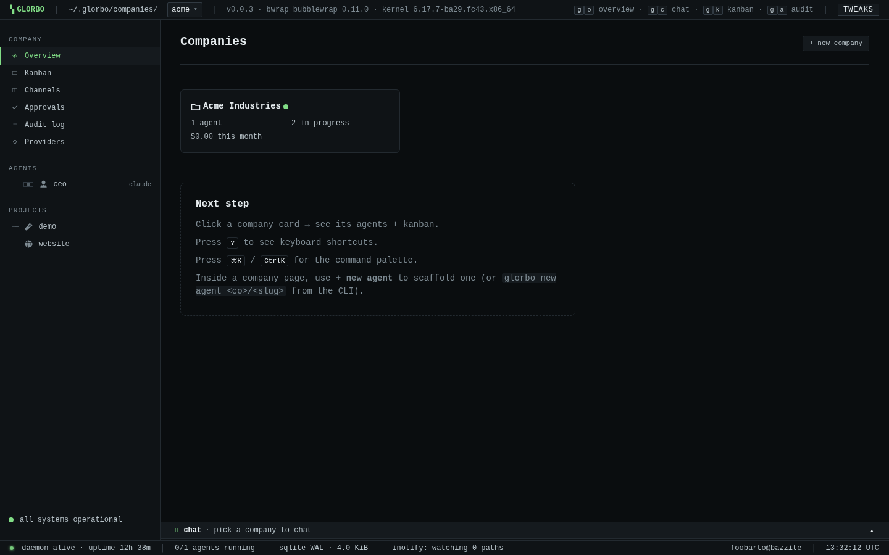
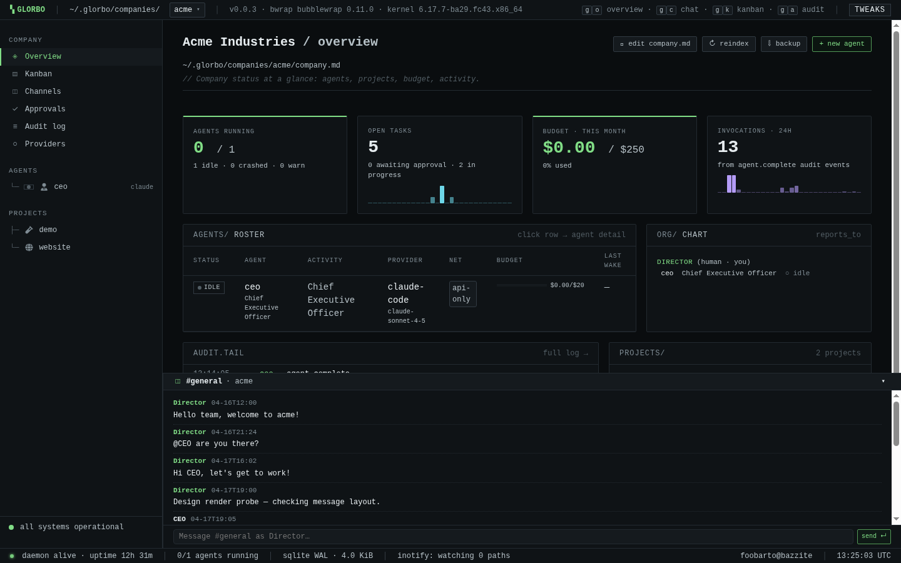
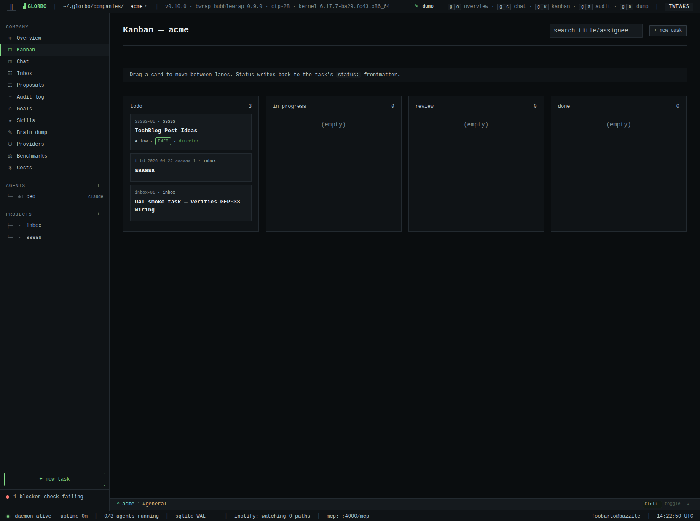
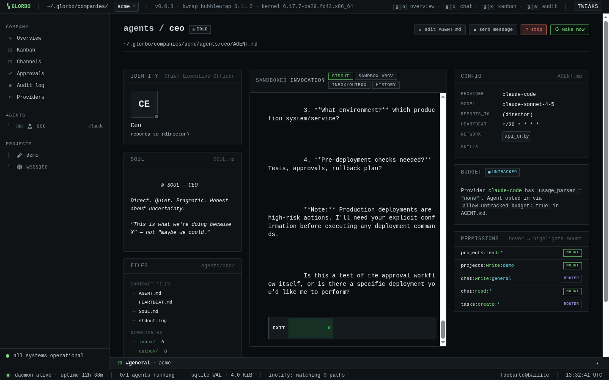
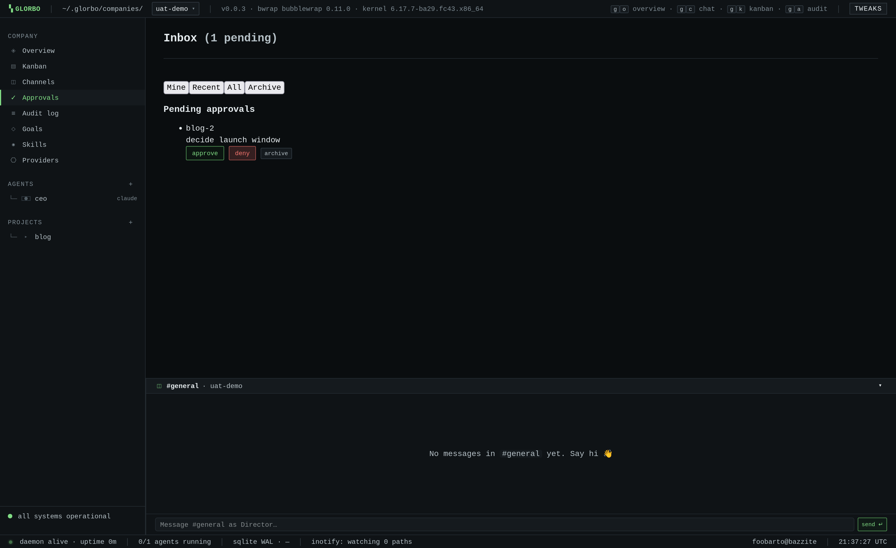
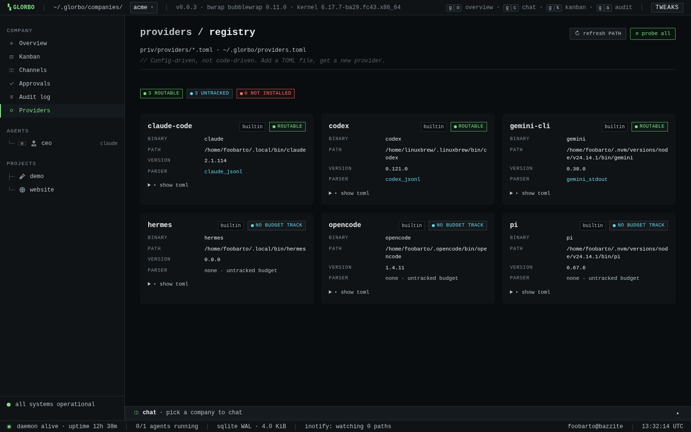

<p align="center">
  
</p>

<p align="center">
  <a href="https://github.com/foobarto/glorbo/actions/workflows/ci.yml"></a>
  <a href="https://github.com/foobarto/glorbo/releases/latest"></a>
  <a href="LICENSE"></a>
  <a href="https://elixir-lang.org"></a>
  <a href="SECURITY.md"></a>
</p>

# Glorbo

> *Finally, a grumbo-compatible agent orchestrator. The fleeb juice is included.*

Glorbo is a self-hosted agent orchestration platform that models companies as
real organisations — org charts, goals, budgets, governance, chat — and runs
AI agents as employees inside kernel-level sandboxes.

**Like Obsidian, but for your agents.** Everything is markdown. Everything is a
file. No cloud, no SaaS, no Kubernetes — just a folder, some `bwrap` sandboxes,
and an Elixir process.

```
~/.glorbo/
├── glorbo                    # Single binary. That's the app.
├── glorbo.db                 # SQLite index. Rebuildable.
└── companies/acme/
    ├── company.md            # Mission, budget, settings
    ├── agents/ceo/AGENT.md   # Identity, permissions, model
    ├── channels/general.md   # Append-only chat logs
    ├── projects/<slug>/tasks/
    └── audit/2026-04.jsonl   # Append-only. Never modified.
```

Back up with `tar`. Version-control with `git`. Move with `scp`. Debug with
`cat`.

## Screenshots

<table>
  <tr>
    <td></td>
    <td></td>
  </tr>
  <tr>
    <td align="center"><sub><code>/companies</code></sub></td>
    <td align="center"><sub><code>/companies/&lt;co&gt;</code> — rollups, roster, org chart</sub></td>
  </tr>
  <tr>
    <td></td>
    <td></td>
  </tr>
  <tr>
    <td align="center"><sub><code>/companies/&lt;co&gt;/kanban</code></sub></td>
    <td align="center"><sub><code>/companies/&lt;co&gt;/agents/&lt;slug&gt;</code></sub></td>
  </tr>
  <tr>
    <td></td>
    <td></td>
  </tr>
  <tr>
    <td align="center"><sub><code>/companies/&lt;co&gt;/inbox</code> — unified approvals</sub></td>
    <td align="center"><sub><code>/providers</code> — CLI + native registry</sub></td>
  </tr>
</table>

Terminal phosphor aesthetic — monospace, OKLCH tokens, lowercase-slash panel
headers. No JS framework, no CSS build step.

## Features

- **Filesystem-first.** Agents, tasks, chat, permissions, goals, and audit
  logs are markdown + JSONL on disk. SQLite is a rebuildable index
  (`glorbo reindex`).
- **Kernel-sandboxed agents.** Every wake is a fresh `bwrap` process with
  user/IPC/PID/net/UTS namespaces unshared and `--cap-drop ALL`. Nothing
  escapes the bind-mount list.
- **Two provider kinds.** CLI adapters for `claude`, `gemini`, `codex`,
  `opencode`, `hermes`, `pi`, etc., plus native OpenAI-compatible endpoints
  (`openai`, `openrouter`, drop-in LM Studio / Ollama / llama.cpp / LocalAI /
  vLLM via `glorbo detect-providers` + `+ enable`). See GEP-32.
- **Budget governance.** Per-agent AND per-company monthly budgets in
  frontmatter; dispatch refuses at 100%, warns at 80%.
- **Permission model.** Declared in `AGENT.md`, enforced at both the Elixir
  router AND the kernel via bwrap mounts. No bind-mount → no access.
- **Real-time dashboard.** Phoenix LiveView at
  `http://127.0.0.1:4000`. Inotify repaints in under a second.
- **Approval + audit trail.** Tasks can require Director approval. Every
  decision writes a structured `YYYY-MM.jsonl` row.
- **Task chain observability.** Every `assigned_to:` flip appends to the
  task's `handoff_chain:` frontmatter; the `/companies/:co/tasks/:id/chain`
  view reconstructs the full multi-agent route with drift detection
  against the audit log (GEP-40).
- **Peer-review gate.** Tasks flagged `severity: major|critical` — or
  any task whose author opts in with `peer_review_required: true` —
  route through the `critiqueops` reviewer before Director approval
  can clear; three-way verdict (approve/revise/block) is append-only
  per task (GEP-41).
- **Single Director write-channel.** Every filesystem mutation the
  Director-facing LiveViews can make flows through `Glorbo.Actions.*`
  modules with slug validation, atomic writes, threatmodel-appropriate
  symlink guards, and audit emission before the `File.*` call lands
  — enforced by a Credo ratchet that rejects raw writes under
  `lib/glorbo_web/live/` (GEP-36).
- **Portable.** `glorbo backup | scp | glorbo restore` reproduces a working
  install on a fresh host.

## Quick Start

### Prerequisites (Linux)

- `bubblewrap` (`bwrap`), `passt` (for enforced `network: proxy`), `inotify-tools`.
- Ubuntu 24.04 / Debian 13: an unconfined AppArmor profile for `/usr/bin/bwrap`
  (template in `.github/workflows/ci.yml`).
- Either a provider CLI on `$PATH` or a native credentials file (see below).

`glorbo doctor` checks and, with `--fix`, repairs what it can.

### Install

**Homebrew (Linux x86_64 / aarch64):**

```bash
brew tap foobarto/tap
brew install glorbo
glorbo init
```

**Manual:**

```bash
curl -L https://github.com/foobarto/glorbo/releases/latest/download/glorbo-linux-$(uname -m) \
  -o ~/.local/bin/glorbo
chmod +x ~/.local/bin/glorbo
glorbo init
```

**macOS** (Intel + Apple Silicon):

```bash
brew tap foobarto/tap
brew install glorbo
glorbo init
```

Both Mach-O binaries are built by CI via Burrito's Zig-based cross-
compile from a Linux runner — no GHA macOS runners needed. On the
target Mac, `bwrap` has no equivalent, so agents run unsandboxed
with a one-time `agent.sandbox_unavailable` audit per company
boot; every other feature (dashboard, routing, scheduling, approval
gates, MCP server, audit log) matches Linux. FSEvents powers the
watcher, and the Burrito binary bundles its own BEAM runtime.

**Windows** — run the Linux binary inside
[WSL2](https://learn.microsoft.com/en-us/windows/wsl/install). No native
Windows port planned (bwrap / inotify / user namespaces).

### Add a native provider

```bash
mkdir -p ~/.local/etc/glorbo/credentials && chmod 700 $_
cat > ~/.local/etc/glorbo/credentials/openai.toml <<'EOF'
api_key = "sk-..."
EOF
```

Then point an agent at `provider: openai` (or `openrouter`) in `AGENT.md`.
The native tool catalog is `read_file` / `write_file` / `edit_file` / `glob`
/ `grep` / `bash` / `web_fetch`. See GEP-32 for the contract.

Or auto-detect a local server:

```bash
glorbo detect-providers     # probes ollama, llama.cpp, LocalAI, vLLM, LM Studio
```

### Hire an agent

Edit `~/.glorbo/companies/acme/agents/ceo/AGENT.md`:

```markdown
---
kind: agent/v1
slug: ceo
role: Chief Executive Officer
provider: claude-code     # or openai / openrouter / ...
model: claude-sonnet-4-5
network: proxy            # none | proxy | open
budget:
  monthly_usd: 100.00
heartbeat: "*/30 * * * *"
permissions:
  - projects:read:*
  - projects:write:*
  - tasks:create:*
  - agents:message:*
  - chat:write:*
---

You are the CEO of {{ company.name }}. Your mission: {{ company.mission }}.
```

### Start

```bash
glorbo up              # Detached daemon — dashboard at http://127.0.0.1:4000
glorbo status
glorbo logs acme ceo --follow
glorbo down
```

## CLI Reference

```
glorbo init [--force] [--no-example]    Bootstrap ~/.glorbo/ and verify deps
glorbo up | down | status | serve       Daemon lifecycle
glorbo new company|agent|project|skill  Scaffold
glorbo doctor [--fix]                   Verify host prerequisites
glorbo detect-providers [--json]        Probe localhost for native providers
glorbo validate [PATH]                  Check files against FileSpec (GEP-25)
glorbo fmt [PATH] [--write]             Normalise frontmatter (GEP-25)
glorbo reindex                          Rebuild SQLite index from filesystem
glorbo backup | restore                 tar.gz roundtrip
glorbo logs <co> [agent] [--follow]     Tail audit or stdout
glorbo console                          iex --remsh into the running daemon
glorbo help [<verb>]
```

The built-in `glorbo harness` subcommand is the internal native-provider
runtime invoked inside bwrap (GEP-32); Directors don't call it directly.

## How It Works

**Director + agents.** You are the Director. You own companies. Agents work
for you. The CEO agent is just the first employee.

**Inbox / outbox.** Agents write to their `outbox/`; Glorbo routes via the
Elixir router (permission-checked, atomic) into the recipient's `inbox/` or
a channel file. Agents never touch each other's directories directly.

**Execution.** An event (inbox item, heartbeat cron, channel mention) wakes
an agent. Glorbo composes a `bwrap` argv from the agent's permissions +
network policy, invokes the provider CLI or `glorbo harness` inside the
sandbox with the prompt on stdin, and reads the answer from
`$GLORBO_REPLY_PATH` when the process exits. Native providers additionally
emit `usage.json` for token accounting and per-tool audit events.

**Sandboxing baseline:**

```
--die-with-parent --unshare-user-try --unshare-ipc --unshare-pid
--unshare-uts --unshare-cgroup-try --new-session --cap-drop ALL
```

Plus workspace `rw`, outbox `rw`, inbox `ro`, per-permission mounts from
`AGENT.md`, and provider credentials bind-mounted `ro` with the right env
redirect (`CLAUDE_CONFIG_DIR`, `CODEX_HOME`,
`GLORBO_NATIVE_CREDENTIALS_PATH`).

**Network policy:**

```
network: none    # --unshare-net (no egress possible)
network: proxy   # Linux: pasta-wrapped, only the Glorbo proxy port visible
network: open    # Inherits host netns
```

**Two-layer permissions.** The kernel layer is the bwrap mount list:
denied paths are simply not mounted. The Elixir router enforces the same
rules as belt-and-braces for cross-directory transfers.

## Tech Stack

| Component | Technology |
|-----------|------------|
| Orchestration | Elixir / OTP |
| Dashboard | Phoenix LiveView |
| Agent Runtime | `bwrap(1)` + provider CLI OR `glorbo harness` |
| LLMs | CLI (`claude`, `gemini`, `codex`, ...) or OpenAI-compatible endpoint |
| Filesystem | `inotify` + `file_system` (FSEvents on macOS) |
| Database | SQLite (via `ecto_sqlite3`) |
| Config / Data | Markdown + YAML frontmatter |
| Audit | JSONL files (append-only) |
| Binary | Burrito + bundled ERTS |

## Design Documents

- **[docs/DESIGN.md](docs/DESIGN.md)** — full living architecture.
- **[docs/geps/](docs/geps/)** — Glorbo Enhancement Proposals (numbered,
  append-only design records). Start with
  [GEP-1](docs/geps/0001-gep-purpose-and-guidelines.md),
  [GEP-2](docs/geps/0002-architecture-overview.md), and the
  [Zen of Glorbo](docs/geps/0011-zen-of-glorbo.md).
- **[docs/architecture.md](docs/architecture.md)** — module map + graph
  caveats (read before greping 200+ modules).
- **[CHANGELOG.md](CHANGELOG.md)** — full release history.

## Project Status

Pre-1.0. Latest release **v0.8.0** (2026-04-24). APIs, CLI flags, on-disk
layout, and SQLite schema may change between minor versions. See
[CHANGELOG.md](CHANGELOG.md) for the full release trail; see
[`docs/geps/`](docs/geps/) for which GEPs are Draft / Accepted /
Implemented.

## Contributing

See [CONTRIBUTING.md](CONTRIBUTING.md). Security reports: [SECURITY.md](SECURITY.md).

Local dev loop:

```bash
git clone https://github.com/foobarto/glorbo && cd glorbo
mix setup           # deps + db + esbuild
mix phx.server      # dashboard on :4000
mix precommit       # format + compile-warn + credo + tests
```

Runtime is Elixir 1.18.4 / OTP 28.0 (pinned in `.tool-versions` —
`mise install` picks them up).

## License

[Apache License 2.0](LICENSE)

---

<sub>*You take the whole Glorbo. You put it on another machine. It's still a Glorbo. What part of this is complicated?*</sub>


